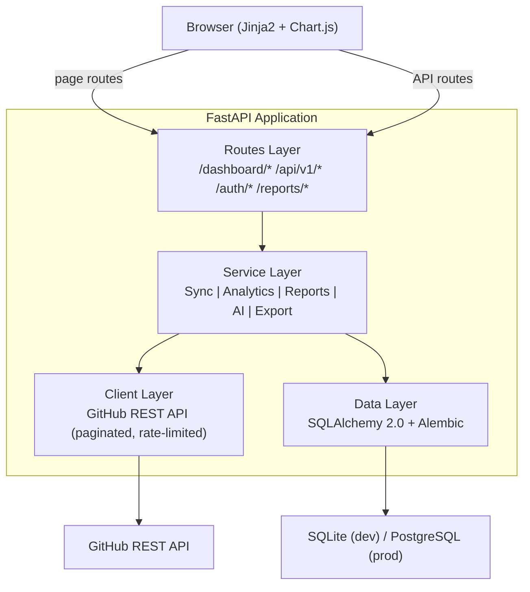
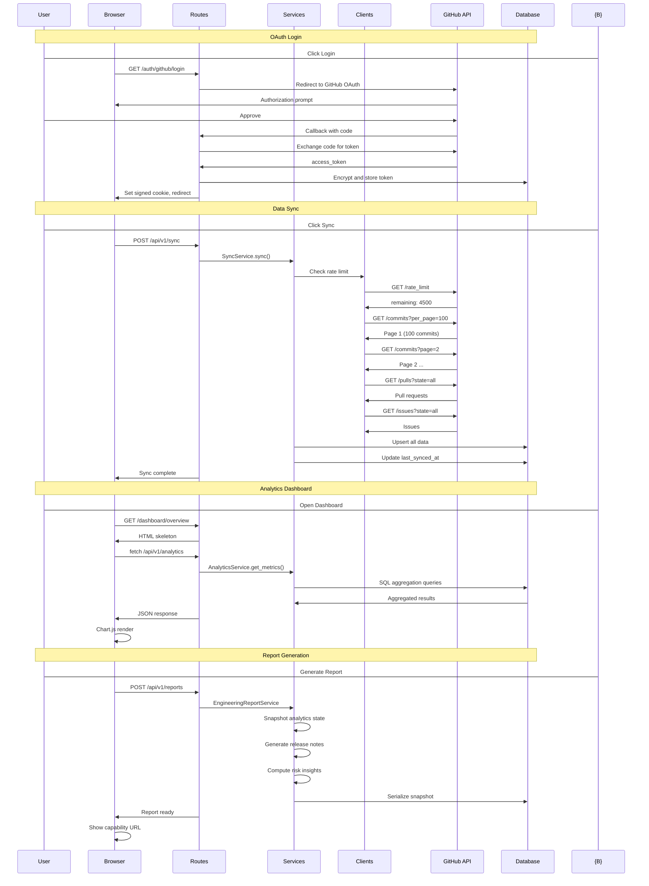

# Git Analytics

Engineering Intelligence Platform for GitHub repository analytics, contributor insights, branch intelligence, and engineering reports.

<p>
  <a href="https://github.com/kh4i-dev/git-analytics/blob/main/LICENSE"></a>
  <a href="https://python.org"></a>
  <a href="https://fastapi.tiangolo.com"></a>
</p>

**Topics**: `fastapi` `github-api` `analytics` `developer-tools` `engineering-dashboard` `sqlalchemy` `chartjs` `python`

---

## 📌 Tổng quan dự án (Project Overview)

**Git Analytics** là nền tảng tự lưu trữ (self-hosted) kết nối bảo mật với GitHub qua giao thức OAuth. Hệ thống tự động đồng bộ hóa lịch sử mã nguồn của repository để cung cấp các phân tích chất lượng kỹ thuật (engineering-grade analytics), chỉ số sức khỏe của nhánh (branch intelligence), báo cáo kỹ thuật bất biến có khả năng chia sẻ an toàn và không gian làm việc AI hỗ trợ nhà phát triển.

### Đối tượng sử dụng chính:
- **Engineering Managers / Tech Leads**: Theo dõi tốc độ phát triển (velocity), phân tích xu hướng đóng góp và tạo báo cáo snapshot định kỳ gửi ban giám đốc.
- **Software Engineers**: Tự động viết Conventional Commit message, rà soát nhanh PR diff và hỏi đáp tự nhiên về mã nguồn cấu trúc hệ thống.

---

## 🚀 Tính năng cốt lõi (Main Features)

- **GitHub Repository Sync**: Đồng bộ hóa không đồng bộ lịch sử commits, pull requests, issues bằng cơ chế đồng bộ gia tăng (incremental sync) thông minh kết hợp cảnh báo giới hạn rate-limit của GitHub.
- **Dashboard Analytics**: Theo dõi điểm sức khỏe dự án (health scoring), biểu đồ phân phối hoạt động, heatmap đóng góp 365 ngày kiểu GitHub và phân tích xu hướng PR/Issues.
- **Branch-Aware Intelligence**: Hỗ trợ bộ lọc chọn nhánh động, giúp xem phân tích độc lập cho từng nhánh riêng biệt hoặc thực hiện đồng bộ riêng cho nhánh chỉ định.
- **Engineering Reports**: Chụp nhanh trạng thái phân tích để tạo báo cáo bất biến, tự động tạo release notes, changelog và phân tích rủi ro. Hỗ trợ xuất định dạng PDF/Excel.
- **Báo cáo Chia sẻ An toàn (Capability URLs)**: Công bố báo cáo qua liên kết công khai ngẫu nhiên ẩn danh hóa tên repo, có quyền hủy bỏ liên kết bất cứ lúc nào (revoke access).
- **AI Workspace**: Không gian trợ lý AI được tích hợp sâu bao gồm:
  - *Gợi ý commit message*: Tự động phân tích git diff để sinh commit chuẩn Conventional Commit.
  - *Rà soát PR diff*: Đánh giá rủi ro bảo mật, hiệu năng, logic và đề xuất viết unit test.
  - *Repo Assistant*: Hỏi đáp tự nhiên bằng tiếng Việt/tiếng Anh về cấu trúc, nghiệp vụ dựa trên ngữ cảnh mã nguồn.
- **Dual AI Modes**: Hỗ trợ song song hai chế độ cấu hình AI:
  - *BYOK (Bring Your Own Key)*: Người dùng tự cung cấp khóa API cá nhân, mã hóa đối xứng Fernet server-side an toàn.
  - *Cloud AI*: Sử dụng API Key hoặc cổng tương thích (OpenClaw gateway) cấu hình sẵn phía máy chủ.

---

## 📐 Kiến trúc hệ thống (Architecture)

### Sơ đồ luồng dữ liệu rộng (Architecture Flow)


### Quy trình Đăng nhập, Đồng bộ và Tạo báo cáo


### Các lớp công nghệ (Layered Stack)

| Lớp (Layer) | Công nghệ | Trách nhiệm chính |
|---|---|---|
| Frontend | Jinja2 + Chart.js | Render giao diện phía server, vẽ biểu đồ tương tác, chủ đề tối (Dark SaaS) |
| Routes | FastAPI | Điều hướng HTTP, xử lý phân tách trang HTML tĩnh và API JSON endpoint |
| Services | Python | Lớp nghiệp vụ xử lý logic chính, điều phối hoạt động đồng bộ/AI/báo cáo |
| Clients | httpx | Thực hiện các cuộc gọi API tới GitHub REST API và cổng AI bên ngoài |
| ORM | SQLAlchemy 2.0 | Tương tác cơ sở dữ liệu, ánh xạ đối tượng, quản lý di chuyển schema |
| Database | SQLite / PostgreSQL | Lưu trữ dữ liệu lâu bền |

---

## 🛠️ Hướng dẫn cài đặt nhanh (Quick Start)

### Yêu cầu hệ thống (Prerequisites)
- **Python 3.11+**
- **GitHub OAuth App** (Tạo tại: *GitHub Settings > Developer Settings > OAuth Apps*)

### 1. Tải mã nguồn về máy
```bash
git clone https://github.com/kh4i-dev/git-analytics.git
cd git-analytics
```

### 2. Thiết lập môi trường ảo Python & Cài đặt thư viện
```bash
python -m venv .venv
# Trên Windows:
.venv\Scripts\activate
# Trên macOS/Linux:
source .venv/bin/activate

pip install -r requirements.txt
```

### 3. Cấu hình biến môi trường
Sao chép file cấu hình mẫu `.env.example` thành `.env`:
```bash
# Trên Windows:
copy .env.example .env
# Trên macOS/Linux:
cp .env.example .env
```
Điền đầy đủ thông tin khóa Client ID/Secret từ GitHub OAuth App của bạn vào tệp `.env`.

### 4. Khởi chạy Database Migrations (Alembic)
```bash
alembic upgrade head
```

### 5. Khởi động Web Server cục bộ
```bash
uvicorn app.main:app --reload
```

| Địa chỉ truy cập | Chức năng |
|---|---|
| `http://localhost:8000` | Trang chủ ứng dụng Git Analytics |
| `http://localhost:8000/docs` | Tài liệu API tương tác tự động (Swagger UI) |
| `http://localhost:8000/health` | API kiểm tra trạng thái sức khỏe hệ thống |

---

## 🤖 Cấu hình tính năng AI (AI Setup)

Git Analytics hỗ trợ hai cơ chế tích hợp trí tuệ nhân tạo để người dùng linh hoạt lựa chọn:

### 1. Chế độ BYOK (Bring Your Own Key)
Người dùng tự quản lý hóa đơn AI của mình bằng cách điền API Key cá nhân trong trang cài đặt.
- Truy cập vào **Settings** > tab **AI Settings**.
- Nhập khóa API của nhà cung cấp bạn muốn dùng: **OpenAI**, **Google Gemini**, hoặc **Anthropic Claude**.
- Hệ thống giải mã an toàn và lưu trữ khóa dạng mã hóa đối xứng đối với từng tài khoản trong Database.

### 2. Chế độ Cloud AI (Server-side Preview)
Nếu bạn triển khai hệ thống cho cả đội ngũ và muốn cung cấp hạn ngạch chạy thử, hãy khai báo các API Key trực tiếp trong file `.env` của máy chủ:
- `OPENAI_API_KEY`, `GEMINI_API_KEY`, `CLAUDE_API_KEY`
- Hoặc định tuyến tất cả cuộc gọi qua một cổng tương thích với chuẩn OpenAI (ví dụ: **OpenClaw**):
  ```env
  OPENAI_COMPATIBLE_BASE_URL=https://your-openclaw-gateway.com/v1
  OPENAI_COMPATIBLE_API_KEY=claw-secret-key
  OPENAI_COMPATIBLE_MODEL=gateway-model-name
  ```
- *Lưu ý*: Nhãn badge trạng thái trên trang AI Tools sẽ tự động cập nhật phản ánh chính xác nhà cung cấp đang chạy thực tế (ví dụ: **`BYOK · Gemini`** hoặc **`Cloud AI · OpenClaw`**).

---

## 🔒 Bảo mật thông tin khóa API (Security Notes)

- **Quy tắc Secret Locality**: Tuyệt đối **KHÔNG** ghi các khóa API cá nhân (BYOK) vào tệp cấu hình `.env` của mã nguồn hay commit chúng lên GitHub.
- **Mã hóa cơ sở dữ liệu**: Mọi khóa BYOK do người dùng cung cấp đều được mã hóa đối xứng bằng thuật toán mật mã Fernet của Python thông qua khóa `ENCRYPTION_KEY` bí mật phía máy chủ trước khi ghi vào Database.
- **Không bao giờ lộ khóa thô**: Các API của Git Analytics không bao giờ trả về chuỗi API Key thô ban đầu ra ngoài giao diện web hay ghi chúng vào file log máy chủ.
- **Bảo vệ Client-side**: Khóa thô tuyệt đối không được lưu tại `localStorage` của trình duyệt để phòng ngừa rủi ro bị tấn công chèn mã độc XSS.

---

## 📂 Danh mục tài liệu kỹ thuật (Documentation Index)

Dưới đây là các tài liệu hướng dẫn chuyên sâu được thiết lập chi tiết trong thư mục `docs/`:

| Thư mục / Tài liệu | Mô tả chi tiết nội dung |
|---|---|
| 🌐 **[CONTEXT.md](CONTEXT.md)** | Thuật ngữ chuyên ngành, định hướng sản phẩm và các nguyên lý thiết kế ứng dụng. |
| 🏗️ **[docs/architecture/architecture.md](docs/architecture/architecture.md)** | Phân tích sâu kiến trúc hệ thống, sơ đồ di chuyển dữ liệu, thiết kế database và hosted production readiness checklist. |
| 🏃‍♂️ **[docs/setup/setup.md](docs/setup/setup.md)** | Hướng dẫn cài đặt cục bộ nhanh và kịch bản trải nghiệm toàn trình cho người dùng cuối. |
| 🗺️ **[docs/roadmap/roadmap.md](docs/roadmap/roadmap.md)** | Lộ trình phát triển chi tiết qua các Phase từ hoàn thành đến kế hoạch tương lai. |
| 📑 **[docs/reports/report-system.md](docs/reports/report-system.md)** | Thiết kế hệ thống báo cáo kỹ thuật bất biến, anonymization và sharing. |
| 🎨 **[docs/setup/ui-guidelines.md](docs/setup/ui-guidelines.md)** | Cẩm nang thiết kế giao diện Dark SaaS, responsive tables và heatmap. |
| 🤖 **[docs/ai/ai-tools.md](docs/ai/ai-tools.md)** | Chi tiết kiến trúc AI Tools, modular templates, static assets, APIs và clear-context. |
| 📘 **[docs/ai/AI_TOOLS_USER_GUIDE.md](docs/ai/AI_TOOLS_USER_GUIDE.md)** | Hướng dẫn sử dụng AI Workspace: dán git diff, đọc badge trạng thái hoạt động. |
| ⚙️ **[docs/ai/AI_CONFIGURATION.md](docs/ai/AI_CONFIGURATION.md)** | Thiết lập tham số `.env`, cấu hình cổng tương thích OpenAI (OpenClaw) và model AI. |
| 💡 **[docs/ai/AI_PROMPT_EXAMPLES.md](docs/ai/AI_PROMPT_EXAMPLES.md)** | Chứa các mẫu prompt chất lượng cao, các ví dụ Git Diff đầu vào hợp lệ/không hợp lệ, bộ câu hỏi mẫu cho Repo Assistant. |
| 🛠️ **[docs/ai/AI_TROUBLESHOOTING.md](docs/ai/AI_TROUBLESHOOTING.md)** | Hướng dẫn giải quyết các lỗi AI thường gặp và xử lý font chữ tiếng Việt. |
| 🔒 **[docs/ai/SECURITY_AI_KEYS.md](docs/ai/SECURITY_AI_KEYS.md)** | Cơ chế mã hóa đối xứng Fernet phía server bảo mật BYOK keys an toàn. |
| 📜 **[docs/roadmap/changelog.md](docs/roadmap/changelog.md)** | Lịch sử cập nhật phiên bản (Changelog). |
| 📜 **[docs/roadmap/release-notes.md](docs/roadmap/release-notes.md)** | Chi tiết các tính năng phát hành (Release Notes). |
| 📂 **[docs/architecture/](docs/architecture/)** | Chứa các tài liệu khám phá sơ khởi (Phase 1, 2, 3), các báo cáo quyết định thiết kế (ADRs) và bản dịch Vietnamese tech summary. |
| 📂 **[docs/diagrams/](docs/diagrams/)** | Chứa các sơ đồ UML SVG và hướng dẫn biểu diễn luồng hoạt động đồng bộ. |
| 📂 **[docs/api/](docs/api/)** | Chứa đặc tả thiết kế REST API chuẩn hóa. |
| 📂 **[docs/analytics/](docs/analytics/)** | Đặc tả công thức toán học tính streaks, KPIs và health score. |

