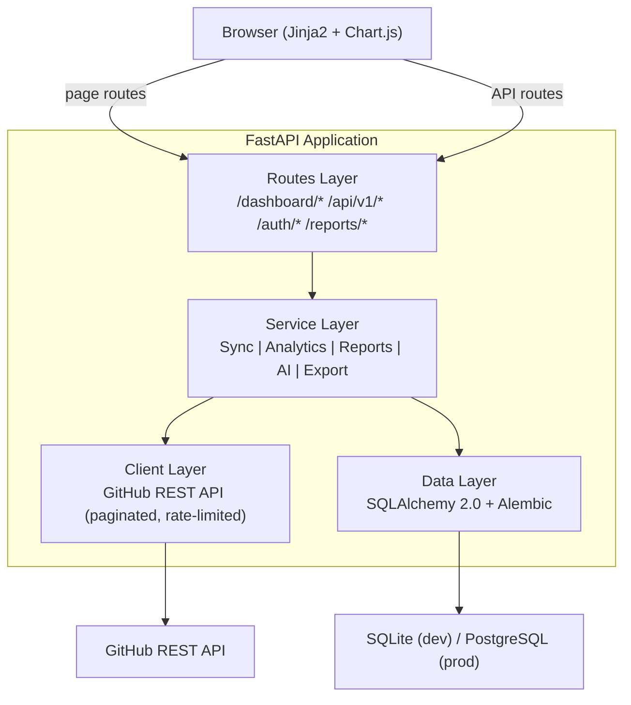
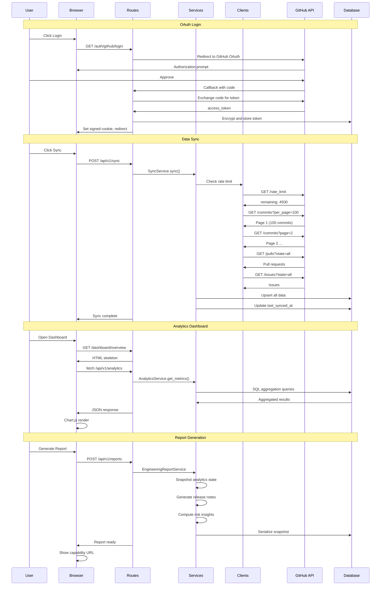
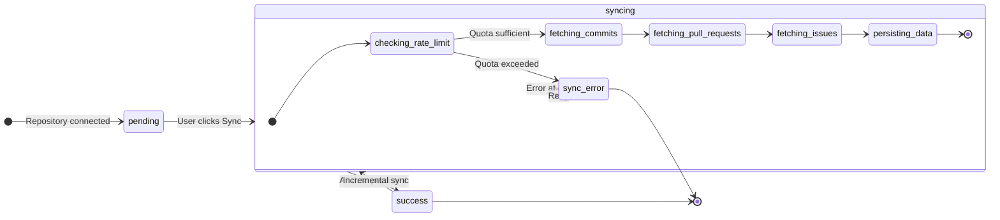

# Git Analytics

Engineering Intelligence Platform for repository analytics, contributor insights, branch intelligence, and AI-powered engineering reports.

[](LICENSE)
[](https://python.org)
[](https://fastapi.tiangolo.com)

---

## Product Positioning

Git Analytics is an Engineering Intelligence Workspace focused on:

- repository health scoring
- contributor insights and KPI tracking
- branch-aware analytics
- engineering KPIs and trends
- immutable engineering reports with public sharing
- AI-powered developer tooling (commit generation, PR review, repo Q&A)

Built as a self-hosted platform connecting to GitHub via secure OAuth. Designed for individual developers who want to understand their repository activity beyond what GitHub Insights provides.

---

## Screenshots

_Add screenshots here for maximum impact._

| Dashboard Overview | Contribution Heatmap |
|---|---|
| `` | `` |

| Repository Analytics | AI Workspace |
|---|---|
| `` | `` |

| Report Export | Branch Analytics |
|---|---|
| `` | `` |

---

## Features

- Multi-branch analytics with branch selector
- Contributor KPI tracking and profiles
- Engineering health scoring (0-100 gauge)
- GitHub OAuth integration with encrypted token storage
- AI commit message generator and PR diff reviewer
- AI repository assistant for natural language Q&A
- Export PDF and Excel engineering reports
- Immutable engineering snapshots with capability URL sharing
- Public report revoke and token rotation
- Report anonymization for public viewers
- GitHub / Vercel-inspired dark SaaS UI
- Contribution heatmap (365-day GitHub-style grid)
- Activity insights (streaks, time-of-day, weekday distribution)
- Pre-sync rate limit guard
- Incremental sync engine (full first, then since)

---

## Architecture



### System Workflows



### Layered Stack

| Layer | Technology | Responsibility |
|---|---|---|
| **Frontend** | Jinja2 + Chart.js | Server-rendered pages, interactive charts, dark SaaS UI |
| **Routes** | FastAPI | HTTP handling, hybrid page/API routing |
| **Services** | Python | Business logic orchestration, domain exceptions |
| **Clients** | httpx | GitHub REST API, pagination, rate limit handling |
| **ORM** | SQLAlchemy 2.0 | Data access, upsert, migration (Alembic) |
| **Database** | SQLite / PostgreSQL | Persistence

---

## Current Scope

### Phase 1 (Active)
- Single repository intelligence
- Immutable engineering reports with public sharing (capability URL)
- Manual sync architecture (button press, no background worker)
- AI workspace with local fallback mode
- PDF and Excel export
- GitHub OAuth authentication

### Phase 2 (Planned)
- Hosted AI providers (OpenAI, Gemini, BYOK)
- Scheduled report generation groundwork
- AI insight layer across all analytics

### Phase 3 (Planned)
- Background workers and queue system
- Async sync engine with retry and recovery
- Tenant isolation

### Phase 4 (Planned)
- Multi-repo intelligence
- Contributor identity resolution (aliases, email mapping, confidence scoring)
- Cross-repo analytics and ranking

---

### Sync State Machine



---

## Not in Scope (Phase 1)

- Background sync worker — sync is manual
- Cross-repo aggregation — single-repo only
- Contributor identity resolution — simple mapping only
- Scheduled report generation — manual generation only
- Multi-user workspace — single-user deployment
- Password-protected reports — capability URL only
- Expiring public links — non-expiring by default
- Enterprise RBAC — no role system
- High-stakes cross-repo KPI — not accurate with current identity mapping

---

## Quick Start

### 1. Clone repository

```bash
git clone https://github.com/kh4i-dev/git-analytics.git
cd git-analytics
```

### 2. Setup environment

```bash
python -m venv .venv
.venv\Scripts\activate
pip install -r requirements.txt
```

### 3. Configure GitHub OAuth

Register an OAuth App at GitHub Settings > Developer Settings > OAuth Apps.

Copy the configuration file:

```bash
copy .env.example .env
```

### 4. Configure environment variables

| Variable | Required | Description |
|---|---|---|
| `GITHUB_CLIENT_ID` | Yes | Your GitHub OAuth App client ID |
| `GITHUB_CLIENT_SECRET` | Yes | Your GitHub OAuth App client secret |
| `SECRET_KEY` | Yes | Session signing key (generate with `os.urandom(24)`) |
| `ENCRYPTION_KEY` | Yes | 32-byte url-safe base64 Fernet key |
| `DATABASE_URL` | No | Default: `sqlite:///./git_analytics.db`. Use PostgreSQL for production |

### 5. Run database migrations

```bash
alembic upgrade head
```

### 6. Start server

```bash
uvicorn app.main:app --reload
```

- Application: `http://localhost:8000`
- API documentation: `http://localhost:8000/docs`
- Health check: `http://localhost:8000/health`

---

## Testing

```bash
.venv\Scripts\python.exe -m pytest -q
python -m compileall app tests
```

---

## Known Limitations

- Sync is manual (button press) — no background worker yet
- Contributor identity resolution is simple (github_login with email fallback); the same person using multiple emails may appear as separate contributors
- Multi-repo intelligence is planned for a later phase
- Reports are single-repository scoped in Phase 1
- Public reports do not support password protection or expiring links in Phase 1
- Token encryption uses Fernet (symmetric); key rotation requires re-encryption

---

## Documentation

| File | Description |
|---|---|
| [CONTEXT.md](CONTEXT.md) | Domain glossary and product principles |
| [docs/architecture.md](docs/architecture.md) | System architecture and data flows |
| [docs/walkthrough.md](docs/walkthrough.md) | End-to-end user flow |
| [docs/roadmap.md](docs/roadmap.md) | Phase roadmap with scope boundaries |
| [docs/report-system.md](docs/report-system.md) | Engineering report system |
| [docs/ai-tools.md](docs/ai-tools.md) | AI workspace documentation |
| [docs/ui-guidelines.md](docs/ui-guidelines.md) | Design system and UI patterns |
| [docs/changelog.md](docs/changelog.md) | Full release history |
