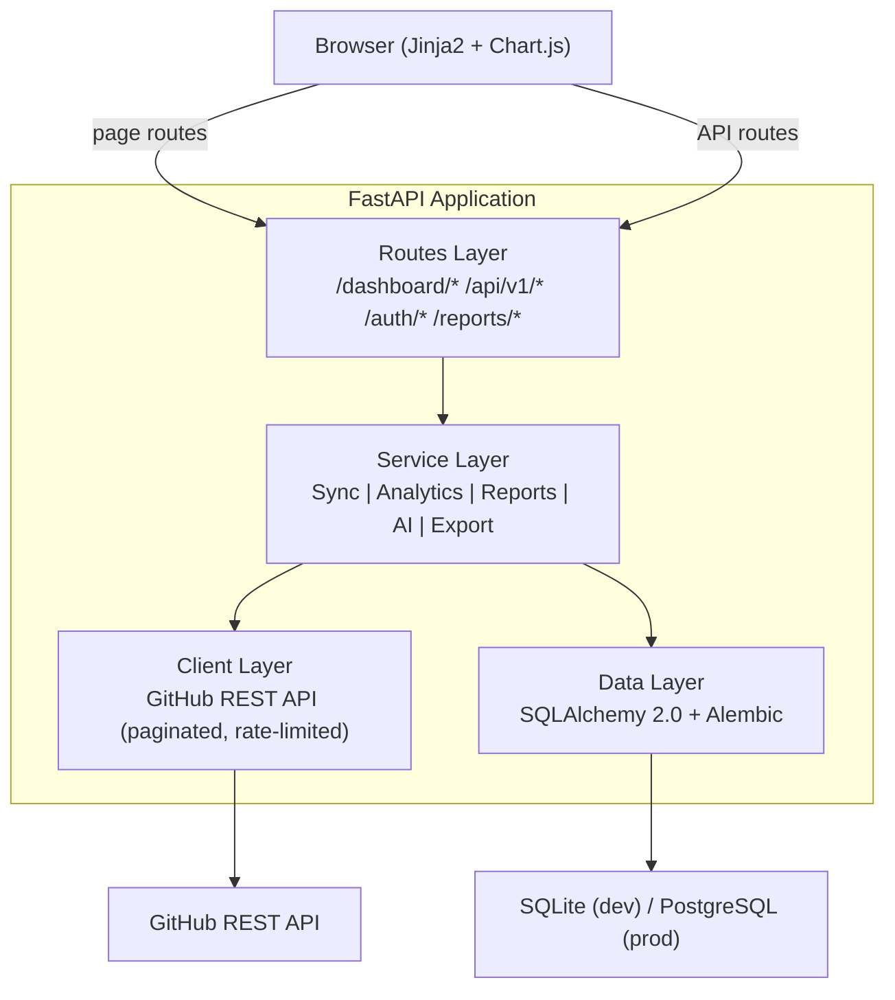
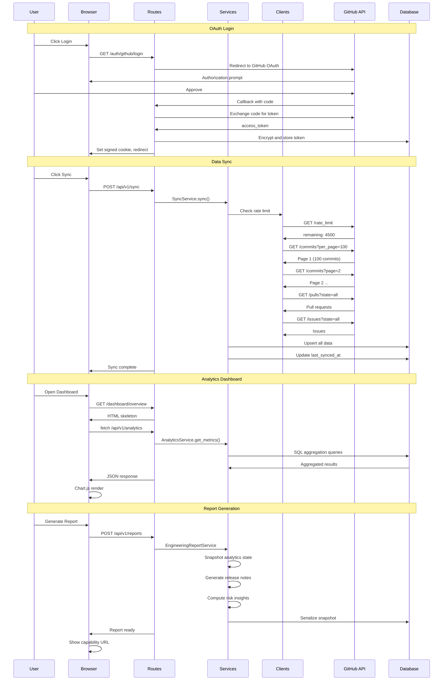
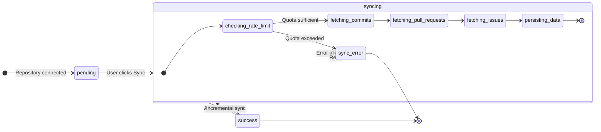

# Git Analytics

Engineering Intelligence Platform for GitHub repository analytics, contributor insights, branch intelligence, and engineering reports.

<p>
  <a href="https://github.com/kh4i-dev/git-analytics/blob/main/LICENSE"></a>
  <a href="https://python.org"></a>
  <a href="https://fastapi.tiangolo.com"></a>
</p>

**Topics**: `fastapi` `github-api` `analytics` `developer-tools` `engineering-dashboard` `sqlalchemy` `chartjs` `python`

---

Self-hosted platform connecting to GitHub via secure OAuth. Syncs repository data and provides engineering-grade analytics, AI-powered insights, and immutable shareable reports.

## Features

- Repository health scoring and KPI tracking
- Branch-aware analytics with branch selector
- Contributor profiles with activity breakdown
- Engineering reports (immutable snapshots with public sharing)
- Report revoke, token rotation, and anonymization
- PDF and Excel export
- AI commit message generator and PR diff reviewer
- AI repository assistant (natural language Q&A)
- Contribution heatmap (365-day GitHub-style grid)
- Activity insights (streaks, time-of-day, weekday)
- Pre-sync rate limit guard
- Incremental sync engine
- GitHub OAuth with encrypted token storage
- Dark SaaS UI (GitHub/Vercel-inspired)

## Architecture





### Layered Stack

| Layer | Technology | Responsibility |
|---|---|---|
| Frontend | Jinja2 + Chart.js | Server-rendered pages, interactive charts, dark SaaS UI |
| Routes | FastAPI | HTTP handling, hybrid page and API routing |
| Services | Python | Business logic orchestration, domain exceptions |
| Clients | httpx | GitHub REST API, pagination, rate limit handling |
| ORM | SQLAlchemy 2.0 | Data access, upsert, schema migrations |
| Database | SQLite / PostgreSQL | Persistence |

### Sync State Machine



## Current Scope

### Phase 1 (Active)
- Single repository intelligence
- Immutable engineering reports with public sharing (capability URL)
- User-triggered and single-process queued sync
- AI workspace with encrypted BYOK and Cloud AI preview modes
- PDF and Excel export
- GitHub OAuth authentication

### Phase 2 (Planned)
- Hosted AI providers (OpenAI, Gemini, BYOK)
- Scheduled report generation groundwork
- AI insight layer across all analytics

### Phase 3 (Planned)
- Background workers and queue system
- Async sync engine with retry and recovery
- Tenant isolation

### Phase 4 (Planned)
- Multi-repo intelligence
- Contributor identity resolution
- Cross-repo analytics and ranking

## Not in Scope (Phase 1)

- External/multi-process sync worker deployment
- Cross-repo aggregation
- Contributor identity resolution
- Scheduled report generation
- Multi-user workspace
- Password-protected reports
- Expiring public links
- Enterprise RBAC
- High-stakes cross-repo KPI

## Quick Start

### Prerequisites

- Python 3.11+
- GitHub OAuth App (GitHub Settings > Developer Settings > OAuth Apps)

### 1. Clone

```bash
git clone https://github.com/kh4i-dev/git-analytics.git
cd git-analytics
```

### 2. Configure

```bash
copy .env.example .env
```

| Variable | Required | Description |
|---|---|---|
| `GITHUB_CLIENT_ID` | Yes | GitHub OAuth App client ID |
| `GITHUB_CLIENT_SECRET` | Yes | GitHub OAuth App client secret |
| `SECRET_KEY` | Yes | Session signing key (`os.urandom(24)`). |
| `ENCRYPTION_KEY` | Yes | 32-byte url-safe base64 Fernet key |
| `DATABASE_URL` | No | Default: `sqlite:///./git_analytics.db` |

### 3. Install

```bash
python -m venv .venv
.venv\Scripts\activate
pip install -r requirements.txt
```

### 4. Migrate

```bash
alembic upgrade head
```

### 5. Run

```bash
uvicorn app.main:app --reload
```

| URL | Description |
|---|---|
| `http://localhost:8000` | Application |
| `http://localhost:8000/docs` | API documentation |
| `http://localhost:8000/health` | Health check |

## Testing

```bash
.venv\Scripts\python.exe -m pytest -q
python -m compileall app tests
```

## Known Limitations

- Sync queue is single-process; hosted deployments still need an external worker strategy
- Contributor identity resolution is simple (github_login with email fallback); same person using multiple emails may appear as separate contributors
- Reports are single-repository scoped in Phase 1
- Public reports do not support password protection or expiring links
- Token encryption uses Fernet (symmetric); key rotation requires re-encryption

## Documentation

| File | Description |
|---|---|
| [CONTEXT.md](CONTEXT.md) | Domain glossary and product principles |
| [docs/architecture.md](docs/architecture.md) | System architecture and data flows |
| [docs/walkthrough.md](docs/walkthrough.md) | End-to-end user flow |
| [docs/roadmap.md](docs/roadmap.md) | Phase roadmap with scope boundaries |
| [docs/report-system.md](docs/report-system.md) | Engineering report system |
| [docs/ai-tools.md](docs/ai-tools.md) | AI workspace documentation |
| [docs/ui-guidelines.md](docs/ui-guidelines.md) | Design system and UI patterns |
| [docs/changelog.md](docs/changelog.md) | Full release history |
