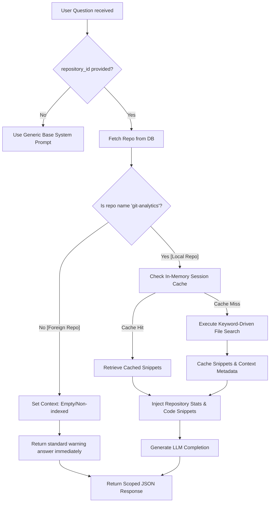

# AI Retrieval Flow & Security Boundaries

This document defines the architecture, retrieval flow, and security invariants governing the Repository AI Assistant. It details how the assistant manages context boundaries, prevents cross-repository leaks, maintains cache isolation, and handles development debugging.

---

## 1. System Context & Indexing Constraints

1. **SQLite Metadata Synchronization**: The sync pipeline in `SyncService` downloads remote git metadata (commits, contributors, branches, pull requests, issues) into the local SQLite database. It does **not** mirror remote file trees or source contents locally.
2. **Local Codebase Invariant**: The local host machine holds exactly **one** physical repository codebase: `git-analytics`.
3. **Safety Indexing Boundaries**:
   - `git-analytics` is the **only** repository marked as `is_indexed = True`.
   - All remote or foreign repositories (such as `BAITAP_HQTCSDL`) have **no indexed source files** available locally on the server filesystem.
   - Consequently, keyword-driven source searches are physically impossible on foreign repositories. The system strictly treats them as empty/non-indexed to prevent leakage of `git-analytics` codebase snippets.

---

## 2. Request Handling & Context Compilation

When a user submits a query to the endpoint `/api/v1/ai/assistant`, the backend executes `answer_question` in `AiToolService` using the following multi-stage boundary check:



---

## 3. Cache & History Isolation Rules

To enforce strict boundary isolation between sessions, branches, and repositories:

### A. Backend Memory Cache
- **Storage Format**: Caches compiled context snippets inside a module-level dictionary `_assistant_cache`.
- **Isolated Cache Keys**: Every cache key strictly incorporates `repository_id` and the selected `branch` name:
  ```
  repo_assistant:{repo_id}:{branch}
  ```
- **Invalidation**: Switching a repository or branch in the dropdown triggers a POST to `/api/v1/ai/clear-context`. The backend immediately deletes the corresponding namespace from `_assistant_cache` to force a clean context reload.

### B. Client-side Local Storage History
- **Storage Format**: Chat histories are persisted per session, per branch, and per repository in the browser's `localStorage`.
- **Isolated Storage Keys**:
  ```
  git_analytics_chat_history:{repo_id}:{branch}
  ```
- **UX Cleanup**: Changing the repository/branch dropdown instantly clears the active viewport, recreates the clean welcome card element, and loads the corresponding scoped history. If the scoped history is empty, suggestions are dynamically updated based on the repository's metadata.

---

## 4. Developer Debug Metadata & Badges

During development and code inspection, developers can verify retrieval boundaries directly on the front-end interface:
- **Response Injection**: The backend response wraps metadata in the `context_metadata` dictionary:
  ```json
  "context_metadata": {
      "repo_name": "kh4i-dev/git-analytics",
      "branch": "main",
      "retrieved_files": ["app/services/sync_service.py"],
      "repository_source": "Local Workspace",
      "retrieved_chunk_count": 1
  }
  ```
- **Visual [Dev Debug] Panel**:
  For every assistant message, a compact, premium inline developer section renders within the context strip showing:
  1. **Source**: Visualized via colored indicator dot (`emerald` for `Local Workspace`, `amber` for `Empty/Non-indexed` repositories).
  2. **Retrieved Chunks**: Count of exact source snippets injected into the LLM system prompt.
  3. **Files**: Total files currently used to extract snippets.
