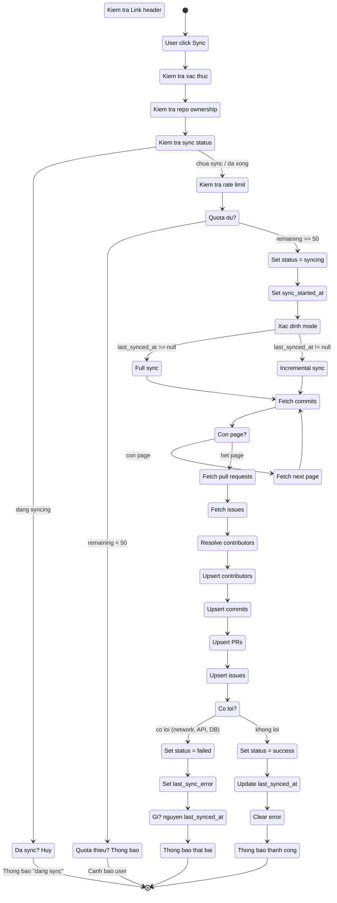
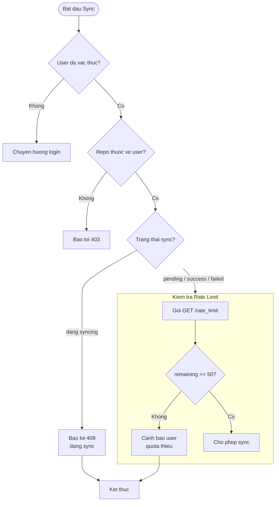
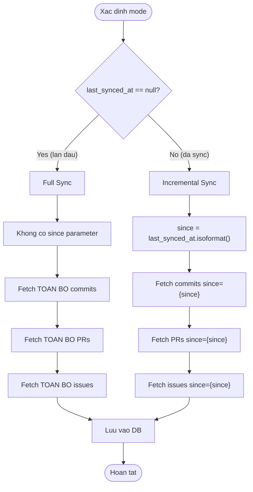
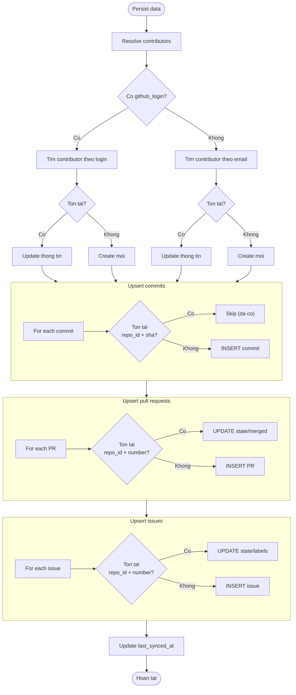
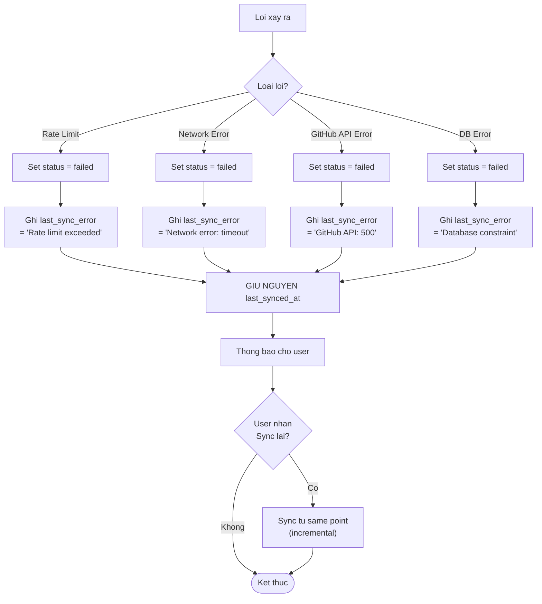
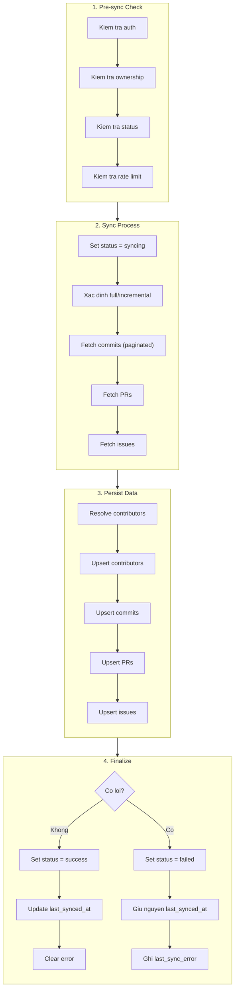

# Activity Diagram — Luồng đồng bộ Repository

---

## 1. Tổng quan luồng Sync

Khi User nhấn nút Sync, hệ thống thực hiện đồng bộ dữ liệu từ GitHub API gồm commits, pull requests và issues.

<div style="background: white; padding: 16px; border-radius: 8px;">



</div>

---

## 2. Activity Diagram — Pre-sync Check

<div style="background: white; padding: 16px; border-radius: 8px;">



</div>

---

## 3. Activity Diagram — Sync Mode Decision

<div style="background: white; padding: 16px; border-radius: 8px;">



</div>

---

## 4. Activity Diagram — Fetch với Pagination

<div style="background: white; padding: 16px; border-radius: 8px;">

```mermaid
flowchart TD
    Start(["Fetch commits"]) --> Page["Goi page = 1<br>per_page = 100"]
    Page --> Response["Nhan response"]
    Response --> CheckRate{"Kiem tra<br>X-RateLimit-Remaining"}
    
    CheckRate -- "== 0 -->" RateLimitErr["Raise<br>GitHubRateLimitExceeded"]
    CheckRate -- "> 0 -->" ParseLink["Doc Link header"]
    
    ParseLink --> HasNext{"Co rel=next?"}
    HasNext -- "Co -->" NextPage["Tang page<br>Goi page tiep theo"]
    NextPage --> Response
    
    HasNext -- "Khong -->" Done["Da lay het data"]
    Done --> End(["Tra ve danh sach"])
    
    RateLimitErr --> EndErr(["Dung sync<br>set status = failed"])
```

</div>

---

## 5. Activity Diagram — Upsert Data

<div style="background: white; padding: 16px; border-radius: 8px;">



</div>

---

## 6. Activity Diagram — Xử lý lỗi

<div style="background: white; padding: 16px; border-radius: 8px;">



</div>

---

## 7. Activity Diagram Tổng Hợp

<div style="background: white; padding: 16px; border-radius: 8px;">



</div>
