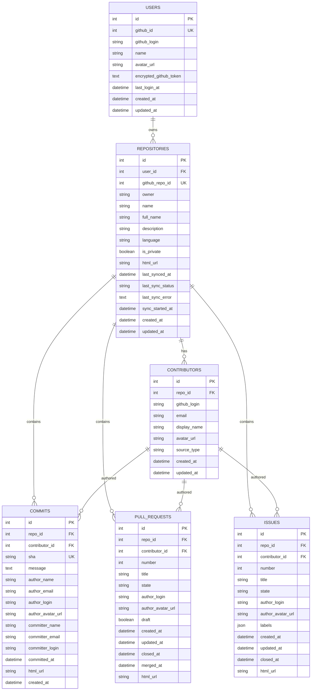

# Phase 3 — Database Design

## 3.1 ERD (Entity Relationship Diagram)

### Mermaid ERD



---

## 3.2 Entity Relationships

### Relationship Map

| Relationship | Type | Mô tả |
|---|---|---|
| User → Repository | One-to-Many | Một user có thể kết nối nhiều repos |
| Repository → Contributor | One-to-Many | Mỗi repo có nhiều contributors |
| Repository → Commit | One-to-Many | Mỗi repo có nhiều commits |
| Repository → PullRequest | One-to-Many | Mỗi repo có nhiều PRs |
| Repository → Issue | One-to-Many | Mỗi repo có nhiều issues |
| Contributor → Commit | One-to-Many | Một contributor có nhiều commits |
| Contributor → PullRequest | One-to-Many | Một contributor tạo nhiều PRs |
| Contributor → Issue | One-to-Many | Một contributor tạo nhiều issues |

### Relationship Reasoning

**User → Repository (1:N)**
- Một user đăng nhập có thể kết nối nhiều repos để phân tích.
- Khi user bị xóa/logout, hệ thống vẫn giữ repos đã sync (soft boundary).
- `user_id` là FK bắt buộc trên `repositories` — mỗi repo phải thuộc 1 user.

**Repository → Contributor (1:N)**
- Contributor thuộc về 1 repository cụ thể.
- Cùng 1 người (cùng github_login) contribute vào 2 repos khác nhau → **2 contributor records riêng biệt**.
- Lý do: đơn giản hóa query analytics (không cần JOIN across repos), và contributor stats luôn per-repo.

**Contributor → Commits/PRs/Issues (1:N)**
- `contributor_id` là FK nullable trên commits, PRs, issues.
- Nullable vì trong quá trình sync, contributor resolution có thể chưa match được ngay.
- Cho phép hệ thống lưu commit trước, resolve contributor sau nếu cần.

---

## 3.3 Table Design (Chi tiết)

### Bảng `users`

| Column | Type | Constraints | Mô tả |
|---|---|---|---|
| `id` | INTEGER | PK, AUTO INCREMENT | Internal ID |
| `github_id` | INTEGER | UNIQUE, NOT NULL | GitHub user ID (stable identifier) |
| `github_login` | VARCHAR(255) | NOT NULL | GitHub username (có thể thay đổi) |
| `name` | VARCHAR(255) | NULLABLE | Display name |
| `avatar_url` | VARCHAR(500) | NULLABLE | GitHub avatar URL |
| `encrypted_github_token` | TEXT | NOT NULL | Fernet-encrypted access token |
| `last_login_at` | DATETIME | NULLABLE | Lần login gần nhất |
| `created_at` | DATETIME | NOT NULL, DEFAULT NOW | Thời điểm tạo record |
| `updated_at` | DATETIME | NOT NULL, DEFAULT NOW | Thời điểm cập nhật cuối |

**Ghi chú:**
- `github_id` là unique identifier vì `github_login` có thể thay đổi (user rename).
- `encrypted_github_token` dùng Fernet symmetric encryption — decrypt khi cần gọi API.
- Không lưu raw token.

---

### Bảng `repositories`

| Column | Type | Constraints | Mô tả |
|---|---|---|---|
| `id` | INTEGER | PK, AUTO INCREMENT | Internal ID |
| `user_id` | INTEGER | FK → users.id, NOT NULL | Owner trong hệ thống |
| `github_repo_id` | INTEGER | NOT NULL | GitHub repository ID |
| `owner` | VARCHAR(255) | NOT NULL | GitHub owner (user/org login) |
| `name` | VARCHAR(255) | NOT NULL | Repository name |
| `full_name` | VARCHAR(500) | NOT NULL | "owner/name" |
| `description` | TEXT | NULLABLE | Mô tả repo |
| `language` | VARCHAR(100) | NULLABLE | Ngôn ngữ chính |
| `is_private` | BOOLEAN | NOT NULL, DEFAULT FALSE | Public hay private |
| `html_url` | VARCHAR(500) | NOT NULL | URL trên GitHub |
| `last_synced_at` | DATETIME | NULLABLE | Thời điểm sync thành công cuối |
| `last_sync_status` | VARCHAR(20) | NOT NULL, DEFAULT 'pending' | pending/syncing/success/failed |
| `last_sync_error` | TEXT | NULLABLE | Mô tả lỗi sync |
| `sync_started_at` | DATETIME | NULLABLE | Phát hiện sync bị stuck |
| `created_at` | DATETIME | NOT NULL, DEFAULT NOW | |
| `updated_at` | DATETIME | NOT NULL, DEFAULT NOW | |

**Unique constraint:** `UNIQUE(user_id, github_repo_id)` — một user không kết nối cùng 1 repo 2 lần.

---

### Bảng `contributors`

| Column | Type | Constraints | Mô tả |
|---|---|---|---|
| `id` | INTEGER | PK, AUTO INCREMENT | Internal ID |
| `repo_id` | INTEGER | FK → repositories.id, NOT NULL | Thuộc repository nào |
| `github_login` | VARCHAR(255) | NULLABLE | GitHub username (nếu verified) |
| `email` | VARCHAR(255) | NULLABLE | Git email (fallback) |
| `display_name` | VARCHAR(255) | NOT NULL | Tên hiển thị |
| `avatar_url` | VARCHAR(500) | NULLABLE | Avatar URL |
| `source_type` | VARCHAR(20) | NOT NULL | "github_user" hoặc "git_email" |
| `created_at` | DATETIME | NOT NULL, DEFAULT NOW | |
| `updated_at` | DATETIME | NOT NULL, DEFAULT NOW | |

**Unique logic (composite):**
- `UNIQUE(repo_id, github_login)` WHERE `github_login IS NOT NULL`
- `UNIQUE(repo_id, email)` WHERE `email IS NOT NULL AND github_login IS NULL`

**Giải thích:** Trong cùng 1 repo:
- Nếu có github_login → unique theo login
- Nếu chỉ có email (login null) → unique theo email
- Tránh duplicate contributor cho cùng 1 người

*Implementation note:* SQLite không hỗ trợ partial unique index. Thay thế bằng application-level check + composite unique `UNIQUE(repo_id, github_login, email)` với xử lý upsert trong code.

---

### Bảng `commits`

| Column | Type | Constraints | Mô tả |
|---|---|---|---|
| `id` | INTEGER | PK, AUTO INCREMENT | Internal ID |
| `repo_id` | INTEGER | FK → repositories.id, NOT NULL | Thuộc repo nào |
| `contributor_id` | INTEGER | FK → contributors.id, NULLABLE | Link đến contributor |
| `sha` | VARCHAR(40) | NOT NULL | Git commit SHA |
| `message` | TEXT | NULLABLE | Commit message (có thể rất dài) |
| `author_name` | VARCHAR(255) | NOT NULL | Tên author từ git config |
| `author_email` | VARCHAR(255) | NOT NULL | Email author từ git config |
| `author_login` | VARCHAR(255) | NULLABLE | GitHub login (nếu verified) |
| `author_avatar_url` | VARCHAR(500) | NULLABLE | Avatar |
| `committer_name` | VARCHAR(255) | NULLABLE | Committer (thường = author) |
| `committer_email` | VARCHAR(255) | NULLABLE | Committer email |
| `committer_login` | VARCHAR(255) | NULLABLE | Committer GitHub login |
| `committed_at` | DATETIME | NOT NULL | Thời điểm commit |
| `html_url` | VARCHAR(500) | NOT NULL | URL commit trên GitHub |
| `created_at` | DATETIME | NOT NULL, DEFAULT NOW | Record creation time |

**Unique constraint:** `UNIQUE(repo_id, sha)` — 1 commit chỉ xuất hiện 1 lần trong 1 repo.

---

### Bảng `pull_requests`

| Column | Type | Constraints | Mô tả |
|---|---|---|---|
| `id` | INTEGER | PK, AUTO INCREMENT | Internal ID |
| `repo_id` | INTEGER | FK → repositories.id, NOT NULL | Thuộc repo nào |
| `contributor_id` | INTEGER | FK → contributors.id, NULLABLE | Link đến contributor |
| `number` | INTEGER | NOT NULL | PR number trên GitHub |
| `title` | VARCHAR(500) | NOT NULL | Tiêu đề PR |
| `state` | VARCHAR(20) | NOT NULL | "open", "closed" |
| `is_merged` | BOOLEAN | NOT NULL, DEFAULT FALSE | Đã merge hay chưa |
| `author_login` | VARCHAR(255) | NOT NULL | Tác giả PR |
| `author_avatar_url` | VARCHAR(500) | NULLABLE | Avatar |
| `draft` | BOOLEAN | NOT NULL, DEFAULT FALSE | Có phải draft PR |
| `created_at` | DATETIME | NOT NULL | Thời điểm tạo PR |
| `updated_at` | DATETIME | NOT NULL | Lần cập nhật cuối |
| `closed_at` | DATETIME | NULLABLE | Thời điểm đóng |
| `merged_at` | DATETIME | NULLABLE | Thời điểm merge |
| `html_url` | VARCHAR(500) | NOT NULL | URL PR trên GitHub |

**Unique constraint:** `UNIQUE(repo_id, number)` — 1 PR number duy nhất trong 1 repo.

**Ghi chú về `is_merged`:**
- GitHub API: nếu `state = "closed"` VÀ `merged_at != null` → PR đã merged.
- Lưu `is_merged` riêng để query đơn giản hơn: `WHERE is_merged = true`.

---

### Bảng `issues`

| Column | Type | Constraints | Mô tả |
|---|---|---|---|
| `id` | INTEGER | PK, AUTO INCREMENT | Internal ID |
| `repo_id` | INTEGER | FK → repositories.id, NOT NULL | Thuộc repo nào |
| `contributor_id` | INTEGER | FK → contributors.id, NULLABLE | Link đến contributor |
| `number` | INTEGER | NOT NULL | Issue number trên GitHub |
| `title` | VARCHAR(500) | NOT NULL | Tiêu đề issue |
| `state` | VARCHAR(20) | NOT NULL | "open", "closed" |
| `author_login` | VARCHAR(255) | NOT NULL | Tác giả issue |
| `author_avatar_url` | VARCHAR(500) | NULLABLE | Avatar |
| `labels` | JSON | NOT NULL, DEFAULT '[]' | Mảng label names |
| `created_at` | DATETIME | NOT NULL | Thời điểm tạo |
| `updated_at` | DATETIME | NOT NULL | Lần cập nhật cuối |
| `closed_at` | DATETIME | NULLABLE | Thời điểm đóng |
| `html_url` | VARCHAR(500) | NOT NULL | URL issue trên GitHub |

**Unique constraint:** `UNIQUE(repo_id, number)` — 1 issue number duy nhất trong 1 repo.

**Ghi chú quan trọng:** GitHub API trả issues **bao gồm cả Pull Requests** (vì PR cũng là issue trên GitHub). Khi sync issues, cần filter bỏ items có field `pull_request` != null.

---

## 3.4 Tại sao dùng JSON column cho Issue Labels

### Lý do chọn JSON thay vì bảng many-to-many

**Phương án 1 (Bảng join):**
```
issues ←→ issue_labels ←→ labels
```
- Cần 2 bảng thêm: `labels` + `issue_labels`
- Cần 2 migrations thêm
- Query "issues by label" cần JOIN
- Đúng chuẩn normalization nhưng quá nặng cho MVP

**Phương án 2 (JSON column — đã chọn):**
```
issues.labels = ["bug", "enhancement", "help wanted"]
```

### Trade-off Analysis

| Tiêu chí | JSON Column | Join Table |
|---|---|---|
| Schema complexity | 0 bảng thêm | +2 bảng |
| Insert/Update | Đơn giản (1 row) | Phức tạp (delete old + insert new) |
| Query by label | Application-level filter | SQL JOIN + WHERE |
| Display on UI | Trực tiếp render badges | Cần JOIN query |
| SQLAlchemy support | JSON type có sẵn | Relationship cần setup |
| Data size | Nhỏ (labels thường < 5 per issue) | Overhead từ FK + index |

### Khi nào cần refactor sang join table

- Khi cần `SELECT * FROM issues WHERE 'bug' IN labels` chạy nhanh trên >10,000 issues
- Khi cần label management (rename, merge, color)
- Khi cần cross-repo label analytics

### MVP Approach

Labels được dùng cho:
1. **Hiển thị** — render label badges trên issue list (đọc trực tiếp JSON)
2. **Group by** — "Issues by label" chart (Python-level grouping, không cần SQL)

```python
# Application-level grouping (đủ nhanh cho MVP)
label_counts = {}
for issue in issues:
    for label in issue.labels:  # JSON array
        label_counts[label] = label_counts.get(label, 0) + 1
```

---

## 3.5 Index Strategy

### Query Patterns → Index Design

| Query Pattern | Sử dụng ở | Index cần thiết |
|---|---|---|
| Lấy repos của 1 user | Repository list page | `repositories(user_id)` |
| Commits theo ngày cho 1 repo | Commits/day chart | `commits(repo_id, committed_at)` |
| Commits theo author cho 1 repo | Commits by contributor | `commits(repo_id, author_login)` |
| PR theo state cho 1 repo | PR status chart | `pull_requests(repo_id, state)` |
| PR created timeline | PR activity chart | `pull_requests(repo_id, created_at)` |
| Merged PRs (tính merge time) | Avg merge time | `pull_requests(repo_id, merged_at)` |
| Issues theo state | Open/closed chart | `issues(repo_id, state)` |
| Issues timeline | Issue activity | `issues(repo_id, created_at)` |
| Closed issues (tính close time) | Avg time to close | `issues(repo_id, closed_at)` |
| Tìm commit by SHA (upsert) | Sync dedup | `commits(repo_id, sha)` — covered by UNIQUE |
| Tìm PR by number (upsert) | Sync dedup | `pull_requests(repo_id, number)` — covered by UNIQUE |
| Tìm issue by number (upsert) | Sync dedup | `issues(repo_id, number)` — covered by UNIQUE |
| Contributors cho 1 repo | Contributor list | `contributors(repo_id)` |
| Contributor by login | Upsert resolution | `contributors(repo_id, github_login)` |
| Contributor by email | Fallback resolution | `contributors(repo_id, email)` |

### Index List (Tổng hợp)

```sql
-- users
CREATE UNIQUE INDEX ix_users_github_id ON users(github_id);

-- repositories
CREATE INDEX ix_repositories_user_id ON repositories(user_id);
CREATE UNIQUE INDEX ix_repositories_user_repo ON repositories(user_id, github_repo_id);

-- contributors
CREATE INDEX ix_contributors_repo_id ON contributors(repo_id);
CREATE INDEX ix_contributors_repo_login ON contributors(repo_id, github_login);
CREATE INDEX ix_contributors_repo_email ON contributors(repo_id, email);

-- commits
CREATE UNIQUE INDEX ix_commits_repo_sha ON commits(repo_id, sha);
CREATE INDEX ix_commits_repo_date ON commits(repo_id, committed_at);
CREATE INDEX ix_commits_repo_author ON commits(repo_id, author_login);

-- pull_requests
CREATE UNIQUE INDEX ix_prs_repo_number ON pull_requests(repo_id, number);
CREATE INDEX ix_prs_repo_state ON pull_requests(repo_id, state);
CREATE INDEX ix_prs_repo_created ON pull_requests(repo_id, created_at);
CREATE INDEX ix_prs_repo_merged ON pull_requests(repo_id, merged_at);

-- issues
CREATE UNIQUE INDEX ix_issues_repo_number ON issues(repo_id, number);
CREATE INDEX ix_issues_repo_state ON issues(repo_id, state);
CREATE INDEX ix_issues_repo_created ON issues(repo_id, created_at);
CREATE INDEX ix_issues_repo_closed ON issues(repo_id, closed_at);
```

### Index Reasoning

**Composite indexes (repo_id + ...):**
- Hầu hết queries đều filter theo `repo_id` trước → đặt `repo_id` làm prefix
- SQLite và PostgreSQL đều tận dụng composite index hiệu quả
- Query `WHERE repo_id = ? AND committed_at >= ?` sẽ dùng `ix_commits_repo_date`

**UNIQUE indexes:**
- Vừa đảm bảo data integrity vừa phục vụ upsert lookup
- `ON CONFLICT (repo_id, sha) DO UPDATE` trong upsert cần unique constraint

**Không cần index cho:**
- `users.id` — đã là PK
- `repositories.id` — đã là PK
- Columns hiếm khi query: `description`, `message`, `html_url`

---

## 3.6 Data Normalization

### Mức normalization

Hệ thống đạt **Third Normal Form (3NF)** cho phần lớn bảng, với 1 ngoại lệ có chủ đích:

| Bảng | NF | Ghi chú |
|---|---|---|
| users | 3NF | Không có transitive dependency |
| repositories | 3NF | Tất cả columns phụ thuộc trực tiếp vào PK |
| contributors | 3NF | Identity riêng per repo |
| commits | 2NF | `author_name`, `author_email` lặp từ contributor — **chấp nhận denormalization** |
| pull_requests | 2NF | `author_login` lặp từ contributor — **chấp nhận denormalization** |
| issues | 2NF | `author_login` lặp + JSON labels — **chấp nhận denormalization** |

### Lý do chấp nhận denormalization ở commits/PRs/issues

1. **Performance:** Tránh JOIN khi hiển thị danh sách commits/PRs trên UI
2. **Data fidelity:** `author_name` và `author_email` trong commit là giá trị gốc từ git history — không nên mất
3. **Contributor resolution có thể fail:** Nếu không match được contributor, vẫn hiển thị được author info
4. **Read-heavy workload:** Dashboard đọc nhiều hơn ghi — denormalize giúp đọc nhanh hơn

### Quy tắc

- `contributor_id` FK dùng cho analytics aggregation (GROUP BY contributor)
- `author_login`, `author_name`, `author_email` dùng cho display và fallback
- Cả hai tồn tại song song — không contradicting

---

## 3.7 Audit / History Strategy

### MVP: Lightweight Audit

Hệ thống MVP **không cần full audit log** (ai thay đổi gì lúc nào) vì:
- Chỉ có 1 user (individual developer)
- Data chủ yếu từ GitHub, không phải user-generated
- Không có role-based access control

### Tracking thay đổi

| Bảng | Audit approach |
|---|---|
| users | `created_at`, `updated_at`, `last_login_at` |
| repositories | `created_at`, `updated_at`, `last_synced_at`, `last_sync_status` |
| commits | `created_at` (immutable after sync — commits don't change) |
| pull_requests | `created_at`, `updated_at` (reflect GitHub's updated_at) |
| issues | `created_at`, `updated_at` (reflect GitHub's updated_at) |

### Sync History (Future Enhancement)

Nếu cần sau MVP, thêm bảng:

```
sync_history
├── id
├── repo_id FK
├── started_at
├── completed_at
├── status (success/failed)
├── error_message
├── commits_synced (count)
├── prs_synced (count)
├── issues_synced (count)
└── api_calls_used (count)
```

Chưa triển khai trong MVP vì `repositories.last_sync_*` fields đủ dùng.

---

## 3.8 Migration Strategy

### Tool: Alembic

Alembic là migration tool chuẩn cho SQLAlchemy, hỗ trợ:
- Auto-generate migrations từ model changes
- Upgrade/downgrade versioning
- Cả SQLite và PostgreSQL

### Migration Workflow

```
1. Developer thay đổi model (app/models/*.py)
2. Chạy: alembic revision --autogenerate -m "add xyz column"
3. Review migration file (migrations/versions/xxxx_add_xyz_column.py)
4. Chạy: alembic upgrade head
5. Commit migration file vào git
```

### Migration Principles

| Principle | Áp dụng |
|---|---|
| Always forward | Không sửa migration đã chạy, tạo migration mới |
| Reversible | Mỗi migration có `upgrade()` và `downgrade()` |
| Small steps | Mỗi migration chỉ thay đổi 1-2 thứ |
| Data-safe | Thêm column mới luôn NULLABLE hoặc có DEFAULT |
| Test trước | Chạy migration trên SQLite dev trước khi apply production |

### Migration Plan MVP

| Order | Migration | Mô tả |
|---|---|---|
| 001 | `create_users_table` | Bảng users với encrypted token |
| 002 | `create_repositories_table` | Bảng repositories với sync fields |
| 003 | `create_contributors_table` | Bảng contributors với identity fields |
| 004 | `create_commits_table` | Bảng commits |
| 005 | `create_pull_requests_table` | Bảng pull_requests |
| 006 | `create_issues_table` | Bảng issues với JSON labels |
| 007 | `create_indexes` | Tất cả non-unique indexes |

### SQLite → PostgreSQL Migration

Khi chuyển từ dev (SQLite) sang production (PostgreSQL):

| Khác biệt | SQLite | PostgreSQL | Xử lý |
|---|---|---|---|
| JSON type | Stored as TEXT | Native JSONB | SQLAlchemy JSON type handles both |
| Boolean | INTEGER (0/1) | Native BOOLEAN | SQLAlchemy Boolean handles both |
| Auto increment | AUTOINCREMENT | SERIAL | SQLAlchemy Integer + PK handles both |
| DateTime | TEXT (ISO format) | Native TIMESTAMP | SQLAlchemy DateTime handles both |
| Partial unique index | Không hỗ trợ | Hỗ trợ | Application-level check cho SQLite |

**Kết luận:** Dùng SQLAlchemy types trừu tượng → code chạy được cả hai DB mà không thay đổi.

---

## 3.9 Data Consistency Considerations

### Upsert Strategy

Khi sync data từ GitHub, dùng **upsert** (INSERT ... ON CONFLICT UPDATE):

```
INSERT INTO commits (repo_id, sha, message, author_name, ...)
VALUES (...)
ON CONFLICT (repo_id, sha) DO UPDATE SET
    message = EXCLUDED.message,
    -- chỉ update fields có thể thay đổi
```

**Lý do dùng upsert:**
- GitHub API có thể trả lại commits/PRs/issues đã sync (do `since` parameter tính theo `updated_at`)
- Tránh IntegrityError khi insert duplicate
- Cập nhật data nếu GitHub đã thay đổi (ví dụ: PR state open → closed)

### Fields nào cần update khi upsert?

| Entity | Mutable fields (cần update) | Immutable fields (skip) |
|---|---|---|
| Commit | Gần như không thay đổi | sha, message, author_*, committed_at |
| Pull Request | state, closed_at, merged_at, updated_at, is_merged | number, created_at, author_login |
| Issue | state, labels, closed_at, updated_at | number, created_at, author_login |
| Contributor | display_name, avatar_url | github_login, email, source_type |

### Cascade Delete

| Khi xóa | Cascade |
|---|---|
| User bị xóa | → Repositories bị xóa → Commits, PRs, Issues, Contributors bị xóa |
| Repository bị disconnect | → Commits, PRs, Issues, Contributors thuộc repo bị xóa |
| Contributor bị xóa | → Commits, PRs, Issues set contributor_id = NULL (SET NULL) |

**Giải thích:**
- Xóa repo = xóa toàn bộ data analytics của repo đó (clean removal)
- Xóa contributor không xóa commits — vì commit data vẫn có giá trị (author_name, author_email còn đó)

### Data Integrity Rules

| Rule | Enforcement |
|---|---|
| Mỗi commit thuộc đúng 1 repo | FK constraint + NOT NULL |
| Không duplicate commit trong 1 repo | UNIQUE(repo_id, sha) |
| Không duplicate PR trong 1 repo | UNIQUE(repo_id, number) |
| Không duplicate issue trong 1 repo | UNIQUE(repo_id, number) |
| User phải có github_id unique | UNIQUE(github_id) |
| Repository thuộc 1 user | FK constraint + NOT NULL |
| Token phải encrypted | Application-level (security module) |
| Sync status valid values | Application-level enum check |

### Concurrent Access

MVP chỉ có 1 user nên concurrent access không phải vấn đề lớn. Tuy nhiên, cần xử lý:

| Scenario | Giải pháp |
|---|---|
| User click Sync 2 lần liên tiếp | Check `last_sync_status = 'syncing'` → reject với ConflictException |
| 2 browser tabs cùng sync | Same as above — DB check prevents double sync |
| Sync đang chạy + user xem dashboard | Không conflict — dashboard đọc data đã committed, sync ghi data mới |

---

## 3.10 Data Volume Estimation

### Typical Individual Developer

| Entity | Estimated volume per repo | Volume cho 5 repos |
|---|---|---|
| Commits | 500 - 5,000 | 2,500 - 25,000 |
| Pull Requests | 20 - 200 | 100 - 1,000 |
| Issues | 10 - 100 | 50 - 500 |
| Contributors | 1 - 20 | 5 - 100 |

### Database Size Estimation

| Scenario | Rows total | Estimated DB size |
|---|---|---|
| Small (3 repos, 1000 commits total) | ~1,200 | < 5 MB |
| Medium (5 repos, 5000 commits total) | ~6,000 | < 20 MB |
| Large (10 repos, 20000 commits total) | ~22,000 | < 80 MB |

**Kết luận:** SQLite hoàn toàn đủ cho MVP. Với data size này, compute-on-read analytics sẽ chạy dưới 100ms cho hầu hết queries.

---

*Kết thúc Phase 3 — Database Design. Tiếp theo: Phase 4 — API Design.*
