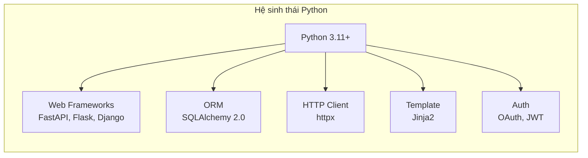
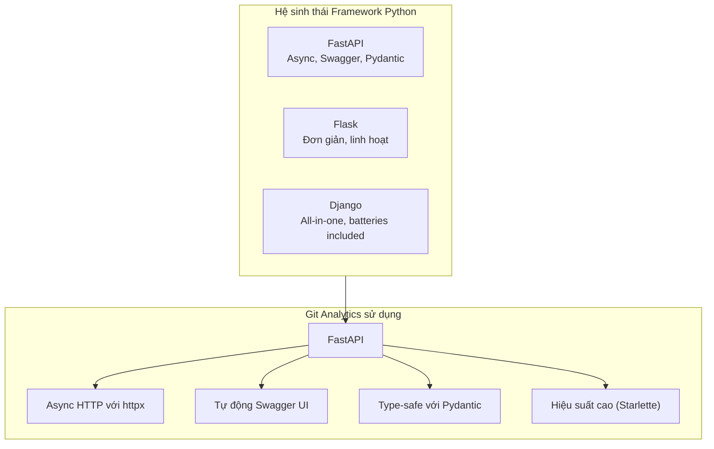
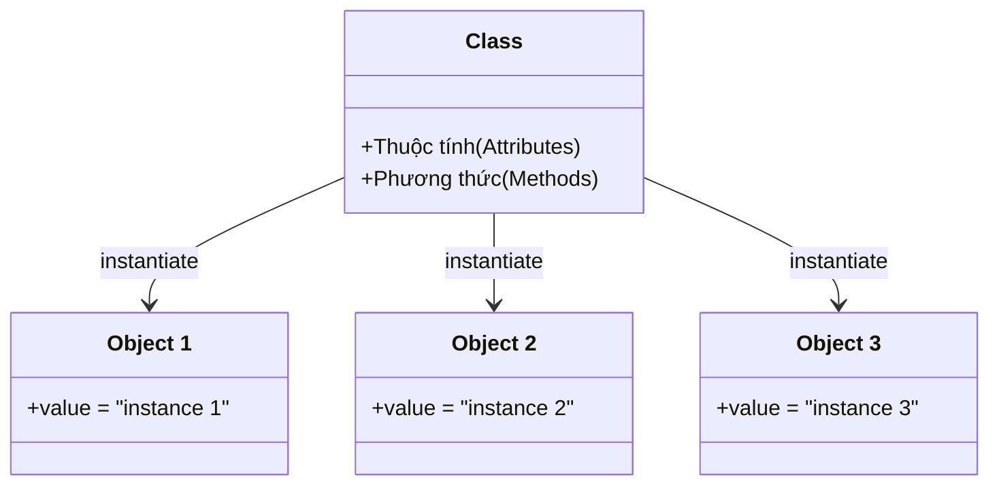
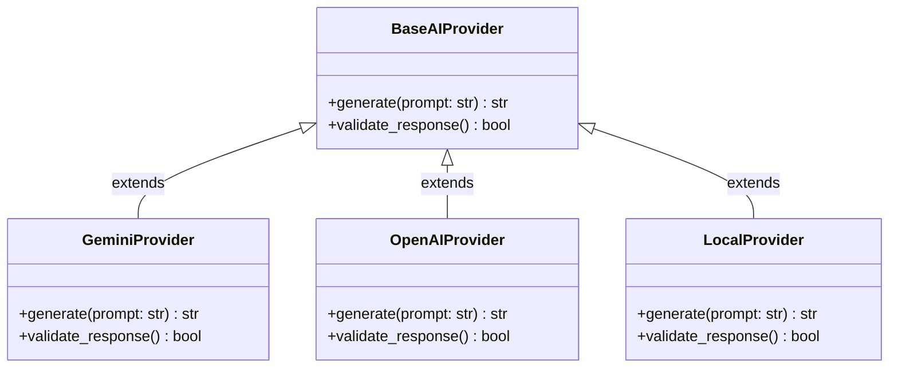
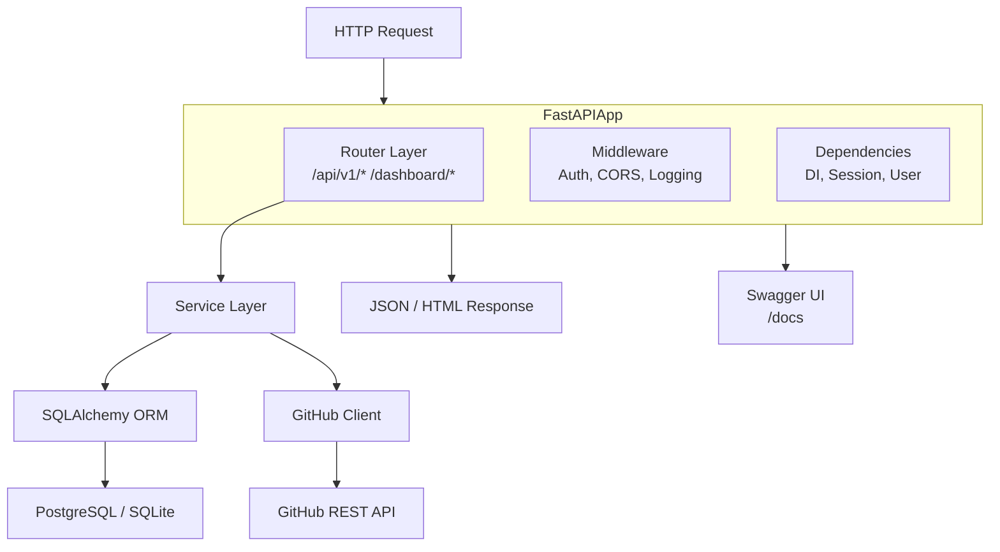
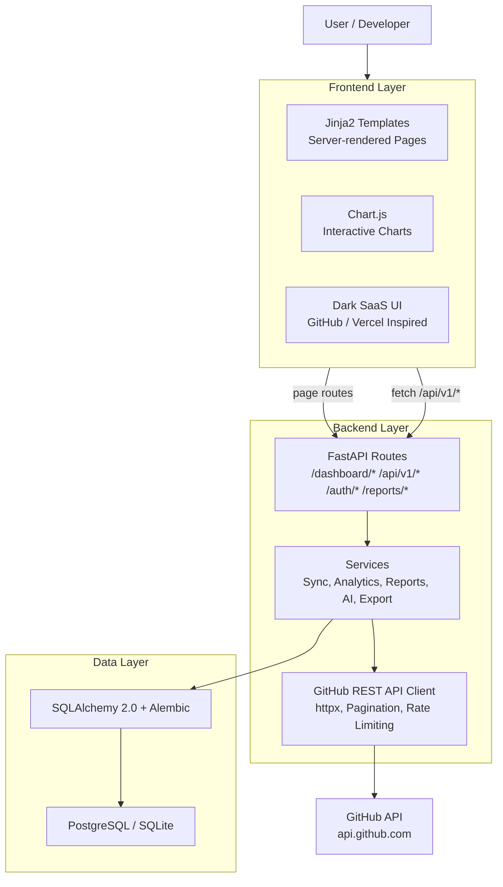
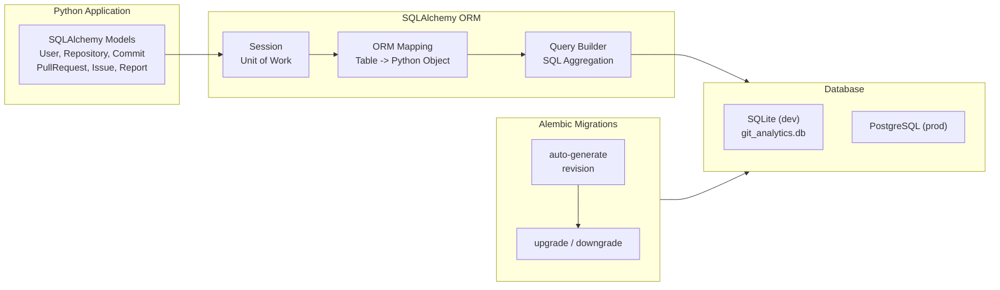
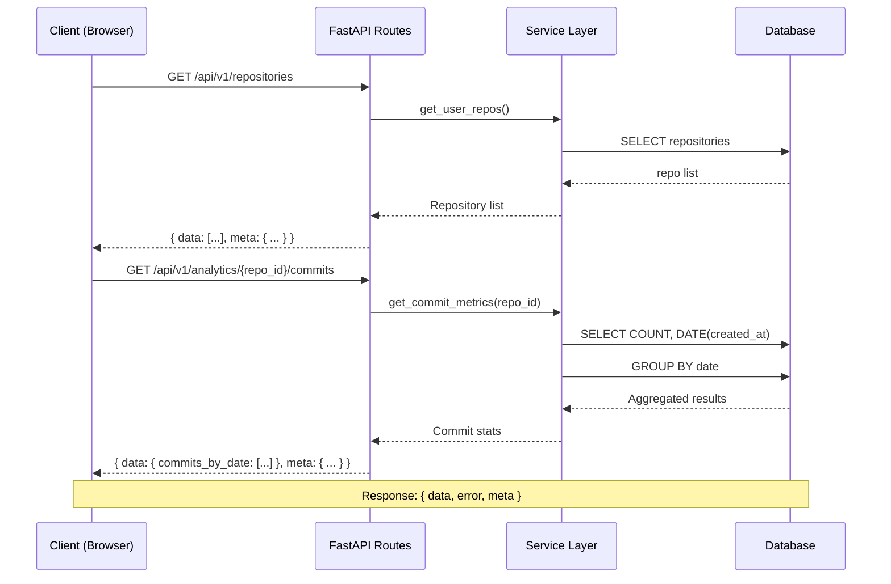
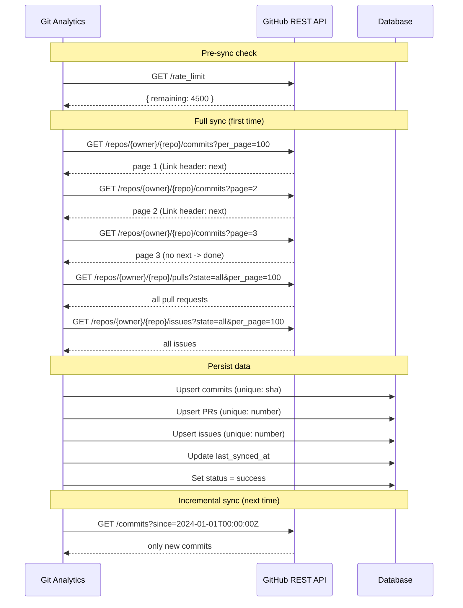

# Công nghệ và Kiến trúc Hệ thống Git Analytics

---

## 1.1 Ngôn ngữ Python

Python là một trong những ngôn ngữ lập trình phổ biến nhất hiện nay, được sử dụng rộng rãi trong phát triển web, khoa học dữ liệu, trí tuệ nhân tạo và tự động hóa. Với cú pháp đơn giản, dễ đọc và hệ sinh thái thư viện phong phú, Python là lựa chọn hàng đầu cho các dự án analytics và backend.

*Hình 1.1: Hệ sinh thái ngôn ngữ lập trình Python trong Git Analytics*

---

Python còn hỗ trợ nhiều framework hiện đại như Flask, Django và FastAPI. Trong dự án Git Analytics, FastAPI được chọn làm framework chính nhờ hiệu suất async vượt trội, tự động sinh tài liệu Swagger, và hỗ trợ type hints với Pydantic.

*Hình 1.2: Một số framework phổ biến trong hệ sinh thái Python và lý do chọn FastAPI*

---

## 1.2 OOP (Lập trình hướng đối tượng)

Lập trình hướng đối tượng (OOP) là mô hình lập trình dựa trên khái niệm lớp (Class) và đối tượng (Object). OOP giúp tổ chức code theo hướng module, dễ bảo trì và mở rộng. Git Analytics áp dụng OOP trong toàn bộ kiến trúc.

*Hình 1.3: Mô hình lập trình hướng đối tượng — Class và Object*

---

Ví dụ về tính kế thừa (Inheritance) trong Git Analytics:

- **BaseAIProvider** — lớp cơ sở định nghĩa interface chung
- **GeminiProvider** — kế thừa và implement cho Google Gemini
- **OpenAIProvider** — kế thừa và implement cho OpenAI

*Hình 1.4: Mô hình kế thừa giữa các AI Provider*

---

## 1.3 Công nghệ Web & Framework

FastAPI là framework web hiện đại dành cho Python, được xây dựng trên Starlette và Pydantic. FastAPI hỗ trợ async/await, tự động validation request/response, và sinh tài liệu OpenAPI (Swagger) tự động.

*Hình 1.5: Kiến trúc hoạt động của FastAPI Framework*

---

Frontend của hệ thống được xây dựng bằng HTML5, CSS3 và JavaScript thuần với kiến trúc hybrid routing: server-render pages kết hợp async JSON API.

*Hình 1.6: Kiến trúc tổng quan hệ thống Git Analytics*

---

## 1.4 Database

Hệ thống sử dụng SQLAlchemy ORM để tương tác với cơ sở dữ liệu. SQLAlchemy cung cấp abstraction layer giúp chuyển đổi giữa Python objects và database tables, hỗ trợ cả SQLite (phát triển) và PostgreSQL (sản xuất). Alembic quản lý migrations schema.

*Hình 1.7: Quy trình tương tác giữa SQLAlchemy và PostgreSQL*

---

## 1.5 API & GitHub API

API là phương thức cho phép các hệ thống giao tiếp với nhau thông qua các endpoint được định nghĩa trước. Git Analytics sử dụng kiến trúc RESTful API với định dạng JSON chuẩn cho tất cả response.

*Hình 1.8: Mô hình giao tiếp RESTful API*

---

GitHub REST API được sử dụng để lấy thông tin repository, commits, pull requests và issues. Git Analytics sử dụng GitHubClient adapter để xử lý authentication, pagination (per_page=100) và rate limiting.

*Hình 1.9: Quy trình đồng bộ dữ liệu từ GitHub API*
