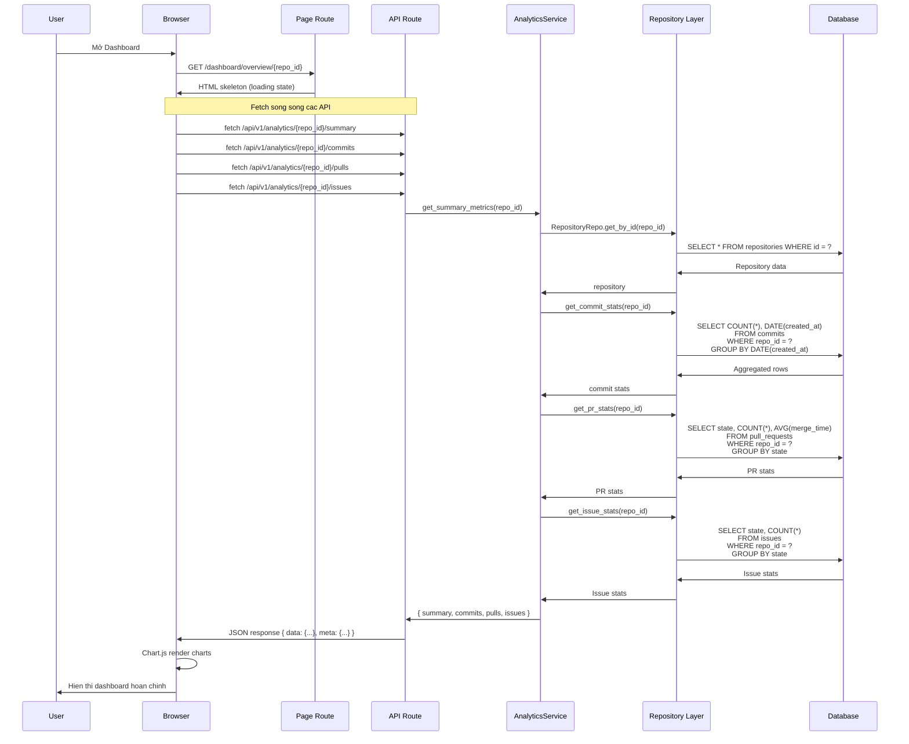
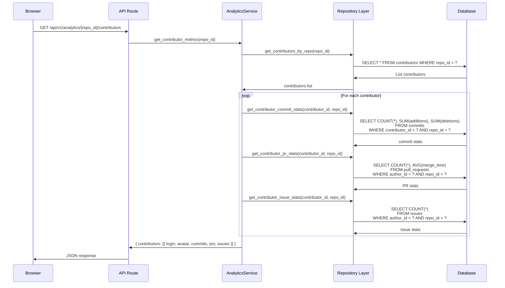
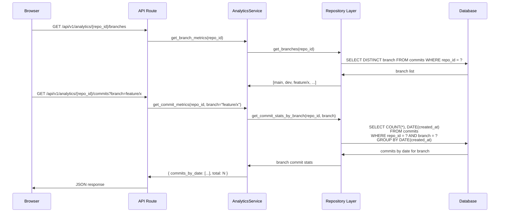
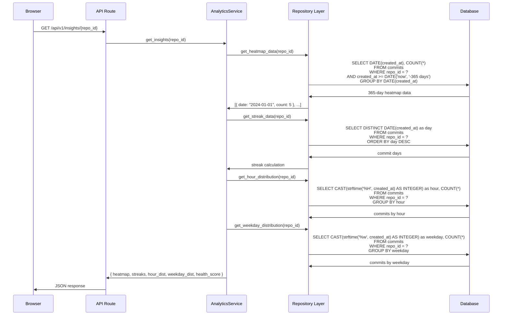
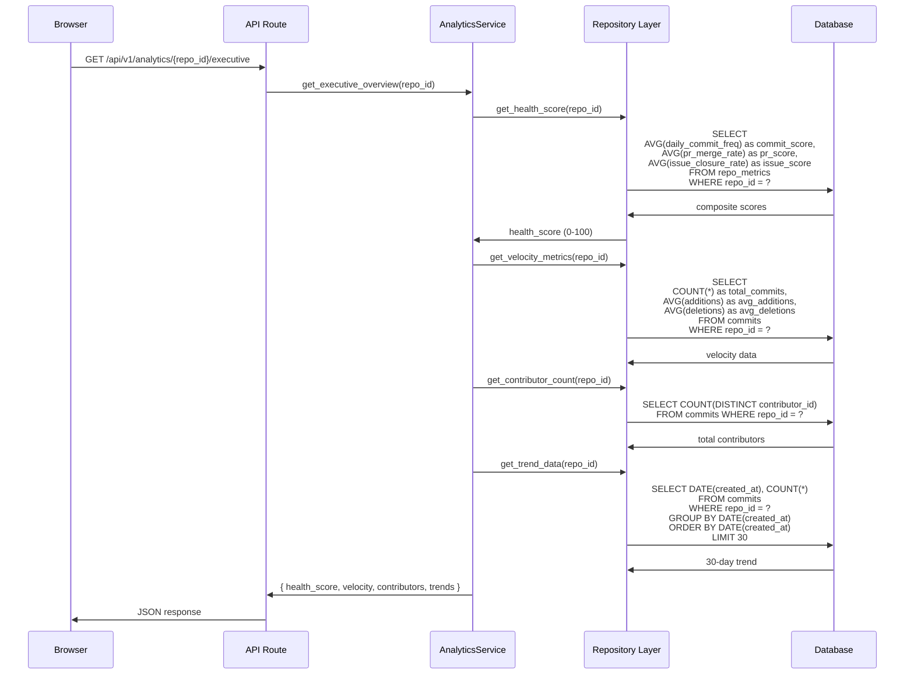
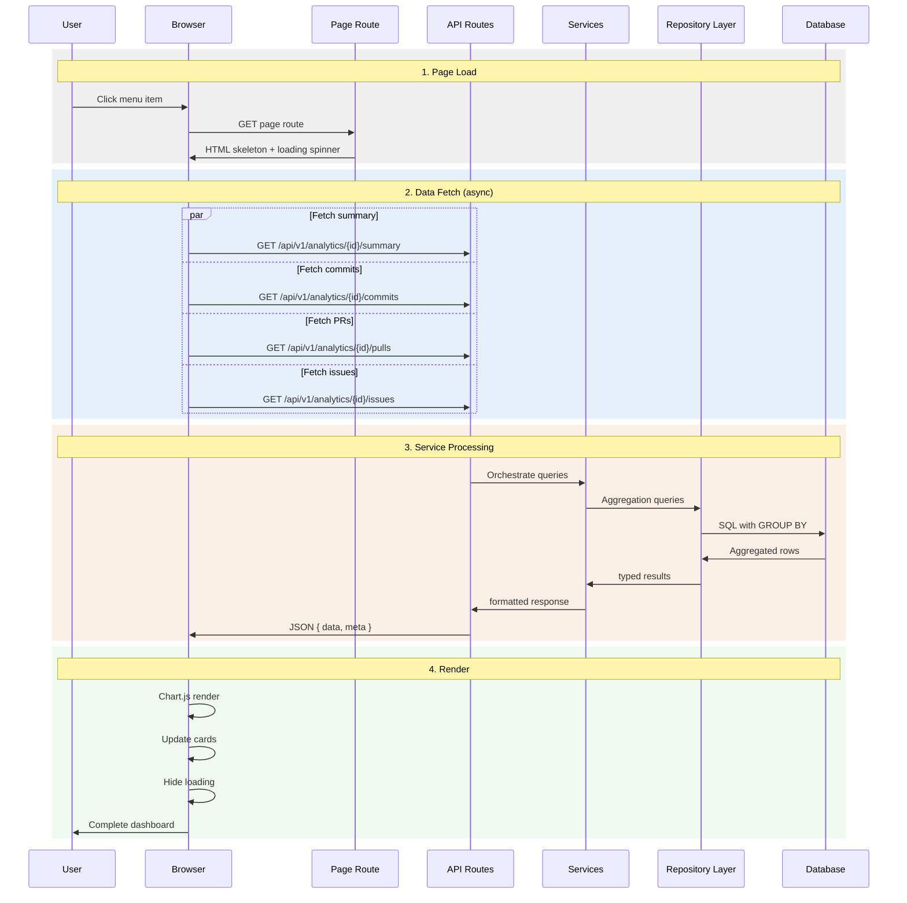

# Sequence Diagram — Xử lý API Analytics

---

## 1. Tổng quan luồng xử lý

Khi User mở một trang dashboard, browser gọi page route để lấy HTML skeleton, sau đó fetch song song các API endpoints để lấy dữ liệu và render Chart.js.



---

## 2. Luồng xử lý Contributor Analytics



---

## 3. Luồng xử lý Branch Analytics



---

## 4. Luồng xử lý Insights (Heatmap + Streaks)



---

## 5. Luồng xử lý Executive Overview



---

## 6. API Response Format

Tat ca API analytics tra ve cung mot format:

```json
{
  "data": {
    "commits": { "total": 150, "by_date": [...] },
    "pulls": { "open": 5, "merged": 20, "closed": 3 },
    "issues": { "open": 8, "closed": 15 }
  },
  "error": null,
  "meta": {
    "trace_id": "abc-123-def",
    "timestamp": "2024-06-15T10:30:00Z"
  }
}
```

---

## 7. Sequence Diagram Tổng Hợp


