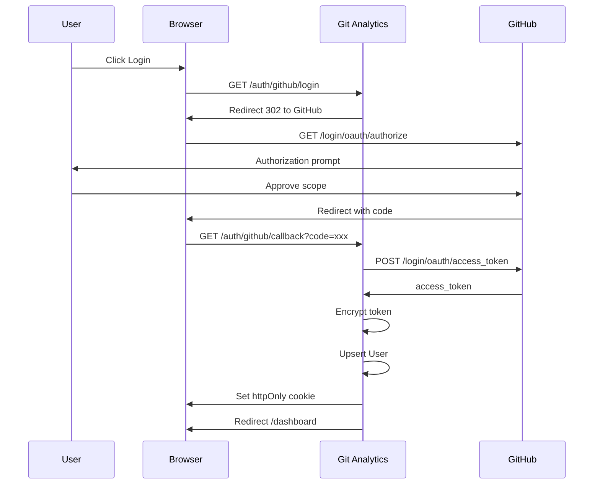
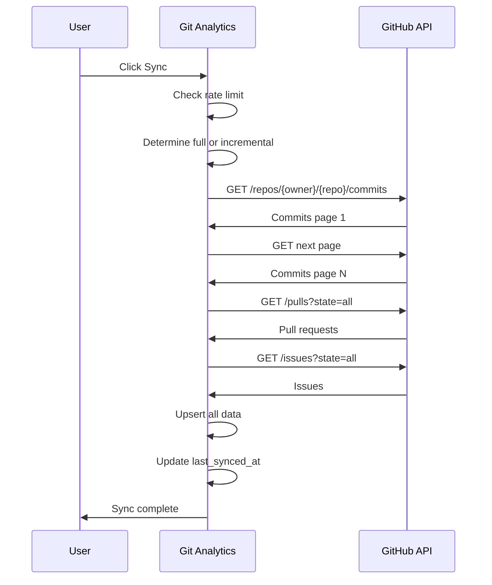
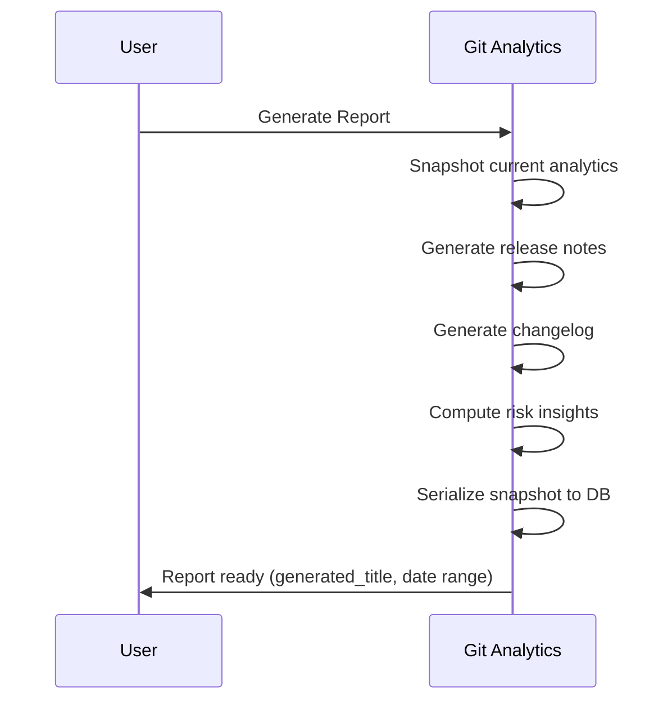
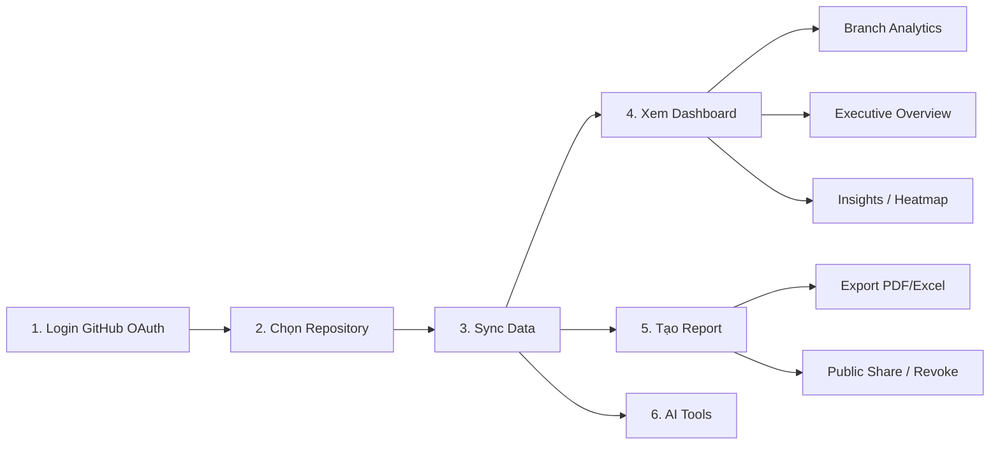

# Use Case — Git Analytics

---

## Tổng quan Use Case

```mermaid
graph TB
    subgraph "Git Analytics System"
        UC01["UC-01: Đăng nhập GitHub OAuth"]
        UC02["UC-02: Xem danh sách repositories"]
        UC03["UC-03: Kết nối repository"]
        UC04["UC-04: Đồng bộ dữ liệu"]
        UC05["UC-05: Xem Dashboard Overview"]
        UC06["UC-06: Xem Commit Analytics"]
        UC07["UC-07: Xem Pull Request Analytics"]
        UC08["UC-08: Xem Issue Analytics"]
        UC09["UC-09: Xem Insights (Heatmap, Streaks)"]
        UC10["UC-10: Xem Branch Analytics"]
        UC11["UC-11: Xem Executive Overview"]
        UC12["UC-12: Tạo Engineering Report"]
        UC13["UC-13: Chia sẻ Report Public"]
        UC14["UC-14: Thu hồi Public Report"]
        UC15["UC-15: Xóa Report"]
        UC16["UC-16: Export PDF / Excel"]
        UC17["UC-17: AI Commit Generator"]
        UC18["UC-18: AI PR Reviewer"]
        UC19["UC-19: AI Repo Assistant"]
        UC20["UC-20: Đăng xuất"]
    end

    User((User / Developer))
    GitHub[(GitHub REST API)]
    Reader((Anonymous Reader))

    User --> UC01
    User --> UC02
    User --> UC03
    User --> UC04
    User --> UC05
    User --> UC06
    User --> UC07
    User --> UC08
    User --> UC09
    User --> UC10
    User --> UC11
    User --> UC12
    User --> UC13
    User --> UC14
    User --> UC15
    User --> UC16
    User --> UC17
    User --> UC18
    User --> UC19
    User --> UC20

    UC01 -.->|<<include>>| GitHub
    UC02 -.->|<<include>>| GitHub
    UC04 -.->|<<include>>| GitHub
    UC12 -.->|<<include>>| UC05
    UC13 -.->|<<include>>| UC12
    Reader --> UC13
```

---

## Authentication

### UC-01: Đăng nhập GitHub OAuth

| Field | Value |
|---|---|
| Actor | User (chưa đăng nhập) |
| Mô tả | User nhấn "Login with GitHub", redirect sang GitHub OAuth, cấp quyền, redirect về hệ thống |
| Precondition | Chưa có session |
| Postcondition | Session tạo, token encrypted lưu trong DB |
| Exception | User từ chối cấp quyền → quay lại login page |

### UC-20: Đăng xuất

| Field | Value |
|---|---|
| Actor | User (đã đăng nhập) |
| Mô tả | User nhấn Logout, session bị xóa, cookie bị clear |
| Precondition | Đã đăng nhập |
| Postcondition | Cookie xóa, redirect về login page |

---

## Repository Management

### UC-02: Xem danh sách repositories

| Field | Value |
|---|---|
| Actor | User |
| Mô tả | Xem danh sách repos từ GitHub (public + private) |
| Precondition | Đã đăng nhập |
| Postcondition | Hiển thị repos với tên, mô tả, ngôn ngữ, visibility |

### UC-03: Kết nối repository

| Field | Value |
|---|---|
| Actor | User |
| Mô tả | Chọn repo từ danh sách để thêm vào hệ thống |
| Precondition | Đã đăng nhập, chọn repo |
| Postcondition | Repo lưu vào DB, status = pending |

### UC-04: Đồng bộ dữ liệu

| Field | Value |
|---|---|
| Actor | User |
| Mô tả | Sync commits, PRs, issues từ GitHub API |
| Precondition | Repo đã kết nối, quota đủ |
| Postcondition | Data sync vào DB, status = success |
| Exception | Rate limit exceeded → dừng, status = failed |

---

## Analytics Dashboard

### UC-05: Xem Dashboard Overview

| Field | Value |
|---|---|
| Actor | User |
| Mô tả | Xem summary cards + charts tổng quan |
| Precondition | Repo đã sync >= 1 lần |
| Postcondition | Hiển thị commits, PRs, issues counts + timeline |

### UC-06: Xem Commit Analytics

| Field | Value |
|---|---|
| Actor | User |
| Mô tả | Xem commits/day, commits by contributor, recent commits |
| Precondition | Repo đã sync |
| Postcondition | Hiển thị charts + tables |

### UC-07: Xem Pull Request Analytics

| Field | Value |
|---|---|
| Actor | User |
| Mô tả | Xem PR status, merge time, PR by author |
| Precondition | Repo đã sync |
| Postcondition | Hiển thị charts + tables |

### UC-08: Xem Issue Analytics

| Field | Value |
|---|---|
| Actor | User |
| Mô tả | Xem open/closed, by label, time to close |
| Precondition | Repo đã sync |
| Postcondition | Hiển thị charts + tables |

### UC-09: Xem Insights

| Field | Value |
|---|---|
| Actor | User |
| Mô tả | Xem heatmap 365 ngày, streaks, activity score, commits by hour/weekday |
| Precondition | Repo đã sync |
| Postcondition | Hiển thị heatmap + statistics |

### UC-10: Xem Branch Analytics

| Field | Value |
|---|---|
| Actor | User |
| Mô tả | Chọn branch để xem analytics riêng |
| Precondition | Repo đã sync multi-branch |
| Postcondition | Hiển thị analytics theo branch đã chọn |

### UC-11: Xem Executive Overview

| Field | Value |
|---|---|
| Actor | User |
| Mô tả | Xem health score, velocity, contributor trends |
| Precondition | Repo đã sync |
| Postcondition | Hiển thị executive cards |

---

## Engineering Reports

### UC-12: Tạo Engineering Report

| Field | Value |
|---|---|
| Actor | User |
| Mô tả | Tạo immutable snapshot của analytics state |
| Precondition | Repo đã sync, có dữ liệu |
| Postcondition | Report snapshot lưu vào DB, kèm release notes + changelog + risk insights |

### UC-13: Chia sẻ Report Public

| Field | Value |
|---|---|
| Actor | User / Anonymous Reader |
| Mô tả | Publish report via capability URL |
| Precondition | Report đã tồn tại |
| Postcondition | Public URL created, reader có thể xem snapshot |

### UC-14: Thu hồi Public Report

| Field | Value |
|---|---|
| Actor | User |
| Mô tả | Revoke public access, giữ nguyên private report |
| Precondition | Report đã publish |
| Postcondition | Public URL trả về 404, owner vẫn access được |

### UC-15: Xóa Report

| Field | Value |
|---|---|
| Actor | User |
| Mô tả | Xóa vĩnh viễn report + public link |
| Precondition | Report tồn tại |
| Postcondition | Report + public token bị xóa |

### UC-16: Export PDF / Excel

| Field | Value |
|---|---|
| Actor | User |
| Mô tả | Download report as PDF or spreadsheet |
| Precondition | Report đã tồn tại |
| Postcondition | File download |

---

## AI Workspace

### UC-17: AI Commit Generator

| Field | Value |
|---|---|
| Actor | User |
| Mô tả | Generate conventional commit message từ staged changes |
| Precondition | Đã đăng nhập |
| Postcondition | Hiển thị generated commit message |

### UC-18: AI PR Reviewer

| Field | Value |
|---|---|
| Actor | User |
| Mô tả | AI review code diff, gợi ý cải thiện |
| Precondition | Đã đăng nhập |
| Postcondition | Hiển thị review (code quality, security, performance) |

### UC-19: AI Repo Assistant

| Field | Value |
|---|---|
| Actor | User |
| Mô tả | Hỏi đáp bằng ngôn ngữ tự nhiên về repository data |
| Precondition | Repo đã sync |
| Postcondition | AI trả lời dựa trên context đã sync |

---

## Flow Tổng Hợp

---

## Danh sách Use Case

| ID | Tên | Priority | Phase |
|---|---|---|---|
| UC-01 | Đăng nhập GitHub OAuth | P0 | 1 |
| UC-02 | Xem danh sách repositories | P0 | 1 |
| UC-03 | Kết nối repository | P0 | 1 |
| UC-04 | Đồng bộ dữ liệu | P0 | 1 |
| UC-05 | Xem Dashboard Overview | P0 | 1 |
| UC-06 | Xem Commit Analytics | P0 | 1 |
| UC-07 | Xem Pull Request Analytics | P1 | 1 |
| UC-08 | Xem Issue Analytics | P1 | 1 |
| UC-09 | Xem Insights | P1 | 1 |
| UC-10 | Xem Branch Analytics | P1 | 1 |
| UC-11 | Xem Executive Overview | P1 | 1 |
| UC-12 | Tạo Engineering Report | P0 | 1 |
| UC-13 | Chia sẻ Report Public | P0 | 1 |
| UC-14 | Thu hồi Public Report | P0 | 1 |
| UC-15 | Xóa Report | P1 | 1 |
| UC-16 | Export PDF / Excel | P1 | 1 |
| UC-17 | AI Commit Generator | P1 | 1 |
| UC-18 | AI PR Reviewer | P1 | 1 |
| UC-19 | AI Repo Assistant | P1 | 1 |
| UC-20 | Đăng xuất | P0 | 1 |
